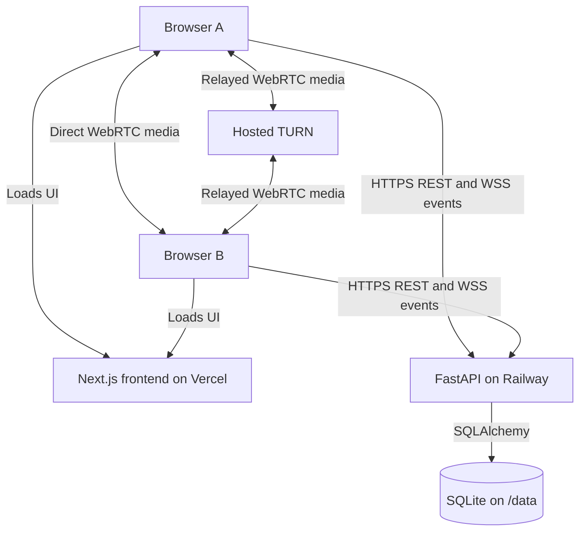
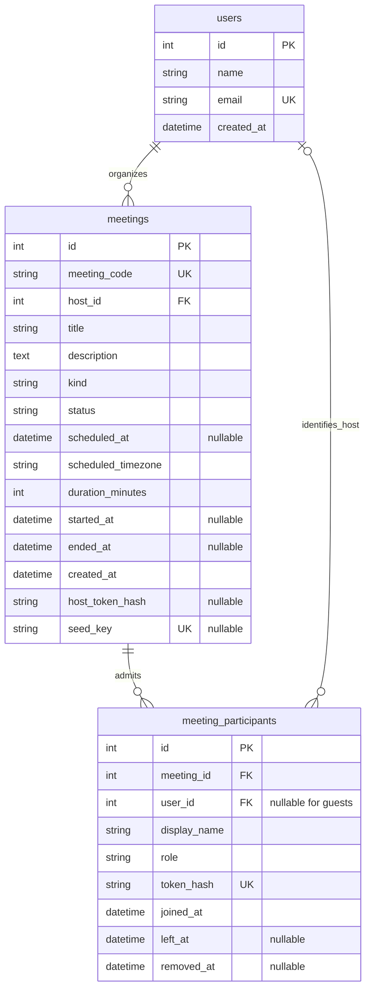

# Zoom Clone

A Zoom-inspired browser application for instant meetings, scheduling, and meeting history. Next.js and FastAPI manage meeting records and signaling; mesh-based WebRTC carries microphone audio, webcam video, and screen sharing. Participants join without an account.

[Live application](https://zoom-clone-vansh.vercel.app) · [Repository](https://github.com/Vansh-7/zoom-clone) · [API documentation](https://zoom-clone-api.up.railway.app/docs) · [Backend health](https://zoom-clone-api.up.railway.app/api/health)

## Features

Features describe the current source, including individual private chat and the latest meeting UI refinements. The recorded production evidence below is for the earlier release `9ef5ffa` and predates private chat.

### Dashboard and meeting management

- Zoom Workplace-inspired workspace with a live clock, meeting actions, and backend availability checks.
- Upcoming and Previous lists backed by SQLite, a split-view meeting manager, meeting details, and invitation copying. Search filters loaded meetings by title or meeting ID.
- Desktop sidebar, tablet layouts, and mobile navigation; keyboard-operable tabs, labeled controls, and visible focus states.

### Creation, joining, and scheduling

- Instant meetings with unique 11-digit IDs and direct invitation URLs.
- Join by ID or an invitation from this application, with meeting-existence checks and a required display name.
- Prejoin camera/microphone preview and device selection, permission feedback, and joining with media disabled.
- Scheduling with title, description, local date/time, and duration. The form displays the detected IANA timezone and a friendly GMT offset; the API retains the timezone and stores the start instant in UTC.
- Downloadable `.ics` invitations containing title, description, start/end time, and join URL, without a calendar account integration.

### Real-time conferencing

Supports up to 4 participants per meeting using mesh-based WebRTC, with real-time audio/video, screen sharing, chat, and host controls.

- Microphone and camera toggles, participant roster, meeting-information popover, and copyable invitations.
- Gallery View with a four-person 2×2 grid, manually selected Speaker View, Hide Self View without stopping outgoing video, and browser fullscreen where available.
- Separate WebSocket signaling and peer-media connection indicators, manual ICE retry, and connection diagnostics that omit credentials, SDP, and candidate addresses.
- Remote audio playback independent of tile placement, with an Enable Audio action when the browser blocks autoplay.

### Screen sharing and collaboration

- Browser-provided screen, window, or tab capture, subject to browser support and the user's selection.
- Independent camera and screen video tracks. The shared presentation is primary while participant cameras remain visible; late joiners receive an active share.
- Everyone (Group Chat) and individual private conversations with a To selector, sender labels, timestamps, Private labels, separate drafts/history, and unread conversation indicators. Scrolling preserves the reader's position; private messages reach only the sender and selected recipient, with no host override.
- Six temporary reactions: clap, thumbs up, laugh, surprised, heart, and celebrate. Each participant's latest reaction disappears after approximately four seconds.
- Raise Hand persists until lowered or the participant disconnects. The server supplies current raised-hand state to late joiners.

### Host controls and safeguards

- Browser-held host capabilities authorize starting scheduled meetings, Mute All, guest removal, and End Meeting for Everyone.
- Admission checks meeting state, room capacity, and duplicate host sessions. Invalid, ended, full, and waiting-for-host states have specific errors.
- REST and WebSocket rate limits, bounded signaling messages, room/session validation, and explicit trusted-proxy handling.
- Leaving, removal, ending, and navigation clean up media tracks, peer connections, WebSockets, and timers.

Demonstration meetings are labeled samples and can be claimed once for host access. Their seeded Previous entries are example records, not evidence of completed calls; application-created meetings remain separate records.

## Stack and Structure

| Layer        | Technology and responsibility                                                                                                                 |
| ------------ | --------------------------------------------------------------------------------------------------------------------------------------------- |
| Frontend     | Next.js 16 App Router, React 19, and strict TypeScript for routes, workflows, and meeting state.                                              |
| UI           | Custom React components and CSS, Tailwind CSS 4 tooling, and Lucide React icons. App Router SVG/PNG icons supply the favicon and mobile icon. |
| API          | Python 3.11, FastAPI, and Pydantic for REST endpoints, validated input, and structured errors.                                                |
| Persistence  | SQLAlchemy ORM and SQLite for organizers, meetings, and participant sessions.                                                                 |
| Signaling    | Authenticated WebSockets for targeted SDP/ICE messages, roster updates, chat, reactions, and host commands.                                   |
| Media        | Browser WebRTC with STUN discovery and optional TURN relay. FastAPI does not receive or forward media.                                        |
| Hosting      | Vercel serves Next.js; one Railway backend worker and replica use a persistent SQLite volume.                                                 |
| Verification | pytest, Ruff, ESLint, TypeScript checks, Prettier, Next.js builds, Playwright, and GitHub Actions.                                            |



The diagram shows two clients for readability. Each additional participant connects to every other participant; TURN relays media only when the selected ICE path requires it.

```text
zoom-clone/
├── frontend/
│   ├── app/                     # Home, meetings, join, schedule, meeting/[code]
│   │   ├── globals.css          # Workspace and responsive meeting layouts
│   │   └── icon.svg             # Original blue-and-white camera icon
│   ├── components/              # Workspace, forms, room, chat, remote audio
│   ├── hooks/
│   │   ├── use-conference.ts    # Mesh negotiation, signaling, room events
│   │   ├── use-local-media.ts   # Capture, input selection, media cleanup
│   │   └── use-screen-share.ts  # Independent display capture
│   ├── lib/                     # API client, invitations, RTC diagnostics
│   ├── types/                   # Shared frontend payload types
│   ├── tests/                   # Workflow, media, mesh, UI, playback tests
│   ├── verification/            # Explicit release acceptance tests
│   └── playwright*.config.ts    # Local, compatibility, release configurations
├── backend/
│   ├── app/
│   │   ├── api/                 # REST routes and request rate limiting
│   │   ├── services/            # Meeting lifecycle, seeding, calendar export
│   │   ├── websocket/           # Room manager, authorization, transport limits
│   │   ├── models.py            # SQLAlchemy tables and constraints
│   │   ├── schemas.py           # Pydantic request/response models
│   │   ├── database.py          # UTC conversion, SQLite engine, sessions
│   │   ├── config.py            # Environment and ICE validation
│   │   ├── proxy.py             # Explicit forwarding-header trust policy
│   │   ├── main.py              # Application startup and maintenance
│   │   └── server.py            # Single-worker Uvicorn entry point
│   ├── tests/
│   └── Dockerfile
├── docs/screenshots/
└── .github/workflows/ci.yml
```

## Database Design



- **Organizer:** `users` contains the default demonstration organizer. It is a record owner, not a login account. `meetings.host_id` is required; a host session also references that user, while guest sessions have no `user_id`.
- **Meeting:** the internal integer `id` is distinct from the public, unique `meeting_code`. Database checks restrict `kind` to `instant`/`scheduled`, `status` to `scheduled`/`in_progress`/`ended`/`missed`, and duration to 5–480 minutes.
- **Participant session:** each admission creates a row with a unique token hash and `host`/`guest` role. Departure and removal timestamps revoke that session without deleting its record. Only one active host is admitted per meeting.
- **Capabilities:** SHA-256 hashes of random host and participant tokens are stored; plaintext tokens are returned only when issued. `seed_key` uniquely identifies sample records. Chat, reactions, raised hands, and live media state are not database columns.
- **Indexes:** unique indexed meeting codes, indexed `ended_at`, `(status, scheduled_at)` for meeting lists, and `(meeting_id, left_at)` for active-session queries. Email, participant token hashes, and non-null seed keys are unique.
- **Time:** `UTCDateTime` rejects naive input, converts aware values to naive UTC for SQLite, and returns aware UTC values. `scheduled_timezone` retains the original IANA zone for display/context; it does not change the stored instant.

SQLite enables foreign keys, WAL mode, and a 15-second busy timeout. Requests use individual SQLAlchemy sessions. Admission uses `BEGIN IMMEDIATE` to serialize capacity and duplicate-host checks before inserting a session. Unique-code collisions are retried up to five times; sample replenishment uses nested transactions/savepoints and unique seed keys to protect concurrent reads.

Startup creates missing tables with `metadata.create_all`; there is no migration framework. Railway stores the database and SQLite companion files on `/data`. Meeting records survive deployment, but startup marks old active sessions left and `in_progress` meetings ended because process-local signaling cannot resume them.

**Sample data:** with `SEED_DATA=true`, startup inserts six fixed sample records once: three scheduled and three example ended meetings. Startup and meeting-list reads replenish each of three upcoming sample slots when no future, unclaimed sample remains, with at most one replacement per slot per UTC day. Existing records and host capabilities are preserved; normal schedule expiry still applies. `SEED_DATA=false` disables new sample meetings and replenishment, preserves existing samples and real meetings, and still initializes the default organizer.

## API

REST endpoints use the backend origin. Interactive schemas are available at `/docs`, `/redoc`, and `/openapi.json`. `{code}` is the public 11-digit meeting code, not the internal database ID. List endpoints return at most 100 records each.

| Method | Endpoint                        | Purpose                                                               | Authorization                                    |
| ------ | ------------------------------- | --------------------------------------------------------------------- | ------------------------------------------------ |
| GET    | `/api/health`                   | Check API and SQLite connectivity.                                    | Public                                           |
| GET    | `/api/user`                     | Return the default organizer.                                         | Public                                           |
| GET    | `/api/meetings`                 | List meetings, newest first.                                          | Public                                           |
| GET    | `/api/meetings/upcoming`        | List scheduled and in-progress meetings.                              | Public                                           |
| GET    | `/api/meetings/recent`          | List ended and missed meetings for Previous.                          | Public                                           |
| POST   | `/api/meetings/instant`         | Create an in-progress instant meeting.                                | Public                                           |
| POST   | `/api/meetings/schedule`        | Save a future scheduled meeting.                                      | Public                                           |
| GET    | `/api/meetings/{code}`          | Return meeting details and invitation URL.                            | Public                                           |
| POST   | `/api/meetings/{code}/claim`    | Claim host access to an unclaimed scheduled sample.                   | Public; sample eligibility checked               |
| GET    | `/api/meetings/{code}/calendar` | Download a scheduled meeting's `.ics` file.                           | Public                                           |
| POST   | `/api/meetings/{code}/start`    | Start a scheduled meeting.                                            | Host bearer token                                |
| POST   | `/api/meetings/{code}/join`     | Admit a named participant and issue a session token.                  | Public for guests; optional host bearer token    |
| POST   | `/api/meetings/{code}/leave`    | Revoke the caller's session and close its socket.                     | Participant bearer token                         |
| POST   | `/api/meetings/{code}/end`      | End an active meeting and disconnect everyone.                        | Host bearer token                                |
| GET    | `/api/rtc-config`               | Return `ice_servers`, `ice_transport_policy`, and `max_participants`. | Public; no-store response                        |
| WS     | `/ws/meetings/{code}`           | Authenticate a session, signal peers, and exchange room events.       | Allowed Origin and first-frame participant token |

There are no meeting edit/cancel, account, or separate REST participant-control endpoints. Removal and Mute All use the room WebSocket.

### Requests, capabilities, and errors

`POST /api/meetings/instant` has no request body. Creation and scheduling return HTTP 201 with `{meeting, host_token}`; sample claim returns the same shape with HTTP 200. The frontend stores host tokens in `localStorage` under `zoom:host:{code}`. A shared organizer name or invitation does not grant host authority.

Example schedule request; the timestamp is 10:00 in `Asia/Kolkata`:

```json
{
  "title": "Architecture review",
  "description": "Review the next release.",
  "scheduled_at": "2027-01-15T04:30:00Z",
  "scheduled_timezone": "Asia/Kolkata",
  "duration_minutes": 45
}
```

Scheduling requires a timezone-aware future timestamp, a valid IANA zone, a trimmed title of 1–200 characters, a description of up to 2,000 characters, and an integer duration of 5–480 minutes. Request schemas reject unknown fields.

Example `POST /api/meetings/12345678901/join` request:

```json
{ "display_name": "Example Guest" }
```

Display names must contain 1–80 characters after trimming. Joining as host includes `Authorization: Bearer <host-capability>`; guests omit that header. A successful HTTP 201 response contains the following fields; `meeting` is abbreviated here:

```json
{
  "participant": { "id": 42, "display_name": "Example Guest", "role": "guest" },
  "participant_token": "<participant-capability>",
  "meeting": { "meeting_code": "12345678901", "status": "in_progress" }
}
```

`participant.id` identifies the admitted session and is used as the signaling target. The participant capability authorizes its WebSocket and leave operation; it cannot start or end a meeting. Full meeting responses contain title, description, kind/status, host name, scheduling and lifecycle timestamps, timezone, duration, invitation URL, and `can_claim`. They omit database IDs and token hashes. Leave/end return `{ "success": true }`.

Errors use `{error: {code, message}}`; HTTP 422 schema errors also contain a field-name map:

```json
{
  "error": {
    "code": "VALIDATION_ERROR",
    "message": "Check the highlighted fields and try again.",
    "fields": { "display_name": "String should have at least 1 character" }
  }
}
```

Important responses include 401 `INVALID_SESSION`, 403 `HOST_REQUIRED`, 404 `MEETING_NOT_FOUND`, and 409 `HOST_NOT_STARTED`, `HOST_ALREADY_JOINED`, `MEETING_FULL`, or `MEETING_ENDED`. Invalid scheduling can return 422 `INVALID_DATE`; database failures return 503 `DATABASE_UNAVAILABLE` without database details. Calendar export returns `text/calendar` with an attachment filename and no-store caching; instant meetings return 409 `NOT_SCHEDULED`.

### Rate limits and proxy identity

REST token buckets run before request-body parsing and database access. Policies are per resolved client IP and route group, with a process-wide bucket at ten times each listed burst and refill rate:

| Group  | Routes                         | Burst | Sustained requests/second |
| ------ | ------------------------------ | ----: | ------------------------: |
| Create | Instant and schedule           |    30 |                       0.5 |
| Join   | Participant admission          |    60 |                         1 |
| Claim  | Sample claim                   |    20 |                      0.25 |
| Read   | GET `/api/*`, excluding health |   120 |                         3 |
| Host   | Start and end                  |    60 |                         1 |

Exhaustion returns HTTP 429 `RATE_LIMITED`, `Retry-After` in seconds, and `Cache-Control: no-store`. Health, OPTIONS, and leave are outside these REST groups. Client bucket storage is bounded to 4,096 keys.

Uvicorn's automatic proxy-header trust is disabled. `TRUSTED_PROXY_CIDRS` permits a single valid `X-Real-IP` only from an explicitly trusted immediate peer; arbitrary `X-Forwarded-For` is ignored. The policy covers HTTP and WebSockets. Production currently has no configured trusted-proxy CIDRs, so limits can aggregate clients behind Railway's edge. Verify actual edge peer ranges and header handling before enabling trust.

### WebSocket protocol

After REST admission, connect using WSS in production and send this first text frame within five seconds:

```json
{ "type": "auth", "token": "<participant-capability>" }
```

Authentication checks the allowed Origin, meeting code, active meeting, token hash, and unrevoked session. `welcome` returns `self_id` and the current `participants`, including each participant's `id`, `display_name`, `role`, `audio_enabled`, `video_enabled`, `screen_sharing`, and `hand_raised`. Membership and role are rechecked against SQLite for subsequent valid messages. The updated server advertises `capabilities: ["private-chat"]`; individual messaging stays disabled when an older server omits that capability.

| Client event         | Payload fields                                                         | Server delivery                                                                                                                                                                                                               |
| -------------------- | ---------------------------------------------------------------------- | ----------------------------------------------------------------------------------------------------------------------------------------------------------------------------------------------------------------------------- |
| `ping`               | None                                                                   | `pong` to the caller; frontend sends every 20 seconds.                                                                                                                                                                        |
| `offer`, `answer`    | `target`, `payload: {type, sdp}`                                       | Matching event with server-assigned `sender` and `payload` to that peer.                                                                                                                                                      |
| `candidate`          | `target`, `payload` containing an RTC candidate                        | Targeted `candidate` with server-assigned `sender`; client includes candidate/MID/ICE-generation fields.                                                                                                                      |
| `restart-ice`        | `target`                                                               | Targeted restart request.                                                                                                                                                                                                     |
| `media-state`        | Boolean `audio_enabled`, `video_enabled`, optional `screen_sharing`    | Updated public `participant` to the room.                                                                                                                                                                                     |
| `chat`               | `text`, trimmed to 1–2,000 characters; optional `recipient_id`         | Server-assigned `chat: {id, participant_id, display_name, recipient_id, recipient_name, text, sent_at}`. Omitted/null recipient broadcasts to the room; an individual recipient delivers only to that session and the sender. |
| `reaction`           | One of `clap`, `thumbs_up`, `laugh`, `surprised`, `heart`, `celebrate` | `participant_id`, `reaction`, generated `id`, and `expires_at` to the room.                                                                                                                                                   |
| `hand-state`         | Boolean `raised`                                                       | Updated public `participant` to the room.                                                                                                                                                                                     |
| `mute-all`           | None; host only                                                        | `mute-request` to other participants and `notice` to the host.                                                                                                                                                                |
| `remove-participant` | `target`; host only                                                    | `removed` to the guest, socket closure, and `participant-left` to others.                                                                                                                                                     |

The server also emits `participant-joined`, `participant-left`, `meeting-ended`, `notice`, and `{type: "error", code, message}`. Targets must belong to the same room and cannot be the sender. Client-supplied identities do not determine reaction, chat, or host authority.

For example, a private chat frame is `{ "type": "chat", "recipient_id": 42, "text": "Can we review this after the call?" }`. The recipient must be another connected, unrevoked participant session in the socket's meeting. Wrong types/self targets return `INVALID_CHAT_RECIPIENT`; unknown, disconnected, removed, and cross-room recipients return `CHAT_RECIPIENT_UNAVAILABLE`. Invalid recipients never fall back to group delivery. Both conversation types share the existing chat throttle and content validation; sender/recipient names and timestamps come from the server.

Reactions allow one event per second; chat requires at least 0.5 seconds between messages. Each authenticated socket has token buckets of 160 messages/40 per second and 20 non-candidate commands/5 per second. Messages are limited to 65,536 UTF-8 bytes; authentication frames to 1,024 bytes. Connection admission is bounded to 128 total sockets, 32 pending authentications, and 8 pending per IP, with additional global/per-IP attempt limits. Eight malformed or unauthorized host commands close the connection. Invalid sessions close with 4401, policy/rate violations with 1008, and oversized frames with 1009.

## Meeting Behavior and Design Decisions

1. **Creation and ownership:** cryptographically generated 11-digit meeting codes are protected by a unique database index. Instant meetings enter `in_progress` immediately. Creation issues a random host capability, stores its hash, and returns the plaintext once. Browser storage retains ownership without adding account infrastructure.
2. **Admission:** ID/link input is validated before prejoin. The server admits only active meetings, serializes capacity checks, and issues a new participant capability for each join. Scheduled guests wait for the host to start; ended/missed meetings reject admission. The fifth active participant receives `MEETING_FULL` at the supported four-person limit.
3. **Scheduling and lifecycle:** the form converts browser-local time to UTC, rejects nonexistent local times and past dates, and sends the detected timezone. Meetings transition `scheduled → in_progress → ended`, or `scheduled → missed` after their scheduled start plus duration passes without starting. Duration controls calendar end time and missed-meeting reconciliation, not an automatic cutoff for active calls. Calendar export uses UTC `DTSTART`/`DTEND`, escaped text, CRLF, and 75-octet line folding.
4. **Mesh negotiation:** each participant maintains `N−1` peer connections; four participants create six pairs, three connections per browser. The lower numeric participant-session ID initiates each pair's offer, avoiding simultaneous offers. `welcome` and `participant-joined` establish new pairs. Async signaling handlers are serialized so offer/answer and candidate processing keep their intended order.
5. **ICE connectivity and recovery:** clients fetch validated STUN/TURN settings from `/api/rtc-config`. Candidates wait for the matching remote description; ICE username fragments distinguish negotiation generations, and the pending queue is bounded to 128 candidates per peer. A 25-second attempt timer provides recovery feedback. Manual retry makes the lower-ID peer send an ICE-restart offer; the other side requests it with `restart-ice`.
6. **Connection reporting:** signaling is connected only after authenticated `welcome`. Media status summarizes each `RTCPeerConnection.connectionState`; an empty room says it is waiting for participants. Connected transport does not prove audible playback or decoded video. Diagnostics include candidate types, selected-pair transport, packet counters, and ICE error codes, without addresses or credentials.
7. **Capture and devices:** prejoin enumerates camera/microphone inputs and requests the selected device. Switching acquires the replacement before stopping the old track, preserves the other media kind and mute state, and retains the old device on failure. Request/lifecycle guards stop capture results that arrive after cancellation or navigation. Camera capture requests an ideal 1280×720 resolution; adaptive quality is not enabled in application code.
8. **Independent camera and screen:** every pair reserves ordered bidirectional audio, camera-video, and screen-video transceivers. The offerer creates them; the answerer uses the negotiated slots. Starting/stopping a share replaces only the screen slot with a track or `null`, leaving microphone and webcam senders intact. Receivers identify the second video transceiver as screen media. Late joiners negotiate the current camera/audio/screen tracks; browser Stop Sharing cleans up only display capture.
9. **Playback and collaboration:** camera and presentation tiles are muted, while one audio-only element per remote participant handles late audio tracks and autoplay retries. This avoids duplicate sound when gallery, speaker, or presentation layouts change. Speaker selection is manual; hiding self changes the preview only. Chat/reactions use the existing room socket, and raised-hand state lives in the server's connection roster. Group chat broadcasts to the room; private chat validates live recipient membership and sends to the two connections only. Conversations and drafts are keyed by session ID, so departure disables the old target and rejoining requires explicitly selecting the new session.
10. **Host actions:** REST start/end require the host capability; WebSocket host commands require a freshly validated host session. Mute All sends a request that the application handles by disabling guest microphone tracks; guests can unmute again. Removal revokes the targeted guest session. End-for-everyone revokes active sessions and closes the room.
11. **Departure and restart:** leaving/disconnecting updates `left_at`, broadcasts roster changes, and closes the departed peer's tracks/connections. A disconnected host has a configurable grace period, default 30 seconds, to rejoin before the server ends the meeting. Admissions without a socket become stale after 60 seconds and are swept every 15 seconds. A backend restart preserves SQLite records but ends old live sessions; a closed signaling socket requires rejoining.
12. **Architecture scope:** SQLite keeps the meeting model and persistence straightforward for a small deployment. One worker owns room state and rate buckets. Mesh WebRTC avoids a media server for four-person rooms, at the cost of per-peer upload and encoding work. Origin checks, capability validation, bounded transport, and rate limits protect the existing public workflow; they do not provide private account-based meetings.

## Screenshots

Existing snapshots from a local production build with SQLite-backed data. The meeting-room image shows two participants with cameras off and a raised hand. Screenshots illustrate the interface; they do not establish media-test results.

| Home                                               | Meetings                                                              |
| -------------------------------------------------- | --------------------------------------------------------------------- |
|             |                             |
| Schedule                                           | Join                                                                  |
|        |                                     |
| Meeting room                                       | Mobile                                                                |
|  |  |

## Run locally

Install Python 3.11 and Node.js 22. From PowerShell:

```powershell
git clone https://github.com/Vansh-7/zoom-clone.git
cd zoom-clone\backend
python -m venv .venv
.\.venv\Scripts\python.exe -m pip install -r requirements-dev.txt
if (!(Test-Path .env)) { Copy-Item .env.example .env }
.\.venv\Scripts\python.exe -m app.server --host 127.0.0.1 --port 8000
```

In a second terminal, from the repository root:

```powershell
cd frontend
npm.cmd ci
if (!(Test-Path .env.local)) { Copy-Item .env.example .env.local }
npm.cmd run dev
```

Open [localhost:3000](http://localhost:3000). Swagger is at [localhost:8000/docs](http://127.0.0.1:8000/docs). Startup initializes SQLite and idempotent sample data. Keep an existing `.env` or `.env.local` when it already contains your configuration.

For a local production build, replace `npm.cmd run dev` with `npm.cmd run build`, then `npm.cmd run start`. On macOS/Linux, use `.venv/bin/python`, `cp`, and `npm` in place of the Windows equivalents.

## Configuration and deployment

Copy the examples in [backend/.env.example](backend/.env.example) and [frontend/.env.example](frontend/.env.example). Actual environment files, databases, and verification artifacts are ignored by Git.

| Variable                   | Default/example                  | Purpose                                                                      |
| -------------------------- | -------------------------------- | ---------------------------------------------------------------------------- |
| `NEXT_PUBLIC_API_BASE_URL` | `http://127.0.0.1:8000`          | Backend origin embedded at frontend build time.                              |
| `DATABASE_URL`             | `sqlite:///./data/zoom.db`       | SQLite file; use `sqlite:////data/zoom.db` on Railway.                       |
| `FRONTEND_URL`             | `http://localhost:3000`          | Origin used to generate invitation URLs.                                     |
| `CORS_ORIGINS`             | Localhost/127.0.0.1 on port 3000 | Comma-separated browser origins, also checked for WebSockets.                |
| `SEED_DATA`                | `true`                           | Initial samples and upcoming-sample replenishment.                           |
| `MAX_PARTICIPANTS`         | `4`                              | Admission capacity; supported and currently deployed limit is four.          |
| `DISCONNECT_GRACE_SECONDS` | `30`                             | Host disconnect grace period before ending the room.                         |
| `ICE_SERVERS_JSON`         | Google STUN entry in the example | Strict JSON array of STUN/TURN definitions.                                  |
| `ICE_TRANSPORT_POLICY`     | `all`                            | Allow direct/relay ICE; `relay` requires TURN and forces relay paths.        |
| `TRUSTED_PROXY_CIDRS`      | Empty                            | Explicitly verified immediate proxy peers allowed to supply client identity. |
| `PORT`                     | `8000`                           | Server listen port; Railway supplies its runtime value.                      |

1. **Railway:** use `backend` as the service root and its Dockerfile. Mount a persistent volume at `/data`, configure the SQLite path above and `/api/health`, and keep one worker/replica. `python -m app.server` reads `PORT` and enforces WebSocket size/queue limits.
2. Set `FRONTEND_URL` and `CORS_ORIGINS` to the exact HTTPS frontend origin. Preserve the volume and existing variables when updating the service. Check volume permissions before changing the runtime user.
3. **Vercel:** use `frontend`, the Next.js preset, Node.js 22, and `NEXT_PUBLIC_API_BASE_URL=https://zoom-clone-api.up.railway.app`. Rebuild when this public API setting changes. HTTPS API configuration produces WSS signaling URLs.
4. Deploy matching tested frontend/backend commits when the signaling protocol changes. Check health, invitations, scheduling, media, and full-room rejection after release. Coordinate backend restarts because active calls cannot survive them.

**TURN:** the local example is STUN-only; production currently returns TURN entries with policy `all`. Set provider-issued values privately in `ICE_SERVERS_JSON` as an array of objects containing `urls`, `username`, and `credential`. Use the provider's actual hostname/ports for `turn:HOST:PORT?transport=udp`, `turn:HOST:PORT?transport=tcp`, and `turns:HOST:TLS_PORT?transport=tcp`. Do not paste a JavaScript constructor or an `iceServers` wrapper into this variable. Validate JSON before applying it and never commit credentials.

For relay verification, use a separate environment with policy `relay`, test each provider transport, and confirm a selected relay candidate plus increasing inbound audio/video RTP and decoded frames on both peers. Repeat between two real devices on independent networks. A configured TURN entry alone does not establish that these checks passed. Browser clients necessarily receive TURN credentials through RTC configuration; provider-scoped/short-lived credentials and usage quotas are needed for a hardened public deployment, and automatic credential rotation is not implemented.

## Tests and verification

Backend, from `backend`:

```powershell
.\.venv\Scripts\python.exe -m pytest -q
.\.venv\Scripts\python.exe -m ruff check app tests
.\.venv\Scripts\python.exe -m ruff format --check app tests
```

Frontend, from `frontend`:

```powershell
npm.cmd run lint
npm.cmd run typecheck
npm.cmd run format:check
npm.cmd run build
npx.cmd playwright install chromium
npm.cmd run test:e2e
```

Start both servers before Playwright. Use a separate SQLite database, for example `DATABASE_URL=sqlite:///./data/e2e.db`, in the backend test-server environment before launching it; browser tests create records. Backend pytest supplies isolated test databases. `E2E_FRONTEND_URL` and `E2E_API_URL` override the default ports 3000/8000. For installed Chrome, set `E2E_BROWSER_CHANNEL=chrome`.

Compatibility checks use `npx.cmd playwright install firefox webkit`, then `npx.cmd playwright test --config playwright.compatibility.config.ts`. Relay tests require backend TURN settings or a private `E2E_RTC_CONFIG_FILE` using the RTC response shape; traces are disabled with that fixture. Optional four-person quality measurements require `E2E_MESH_PERFORMANCE=1` and an isolated test backend; they do not enable adaptive capture in production.

The [GitHub Actions workflow](.github/workflows/ci.yml) runs backend pytest/Ruff and frontend lint, type checking, formatting, production build, and Chromium Playwright against local services on pushes and pull requests.

Local checks below cover the current UI/private-chat changes on October 10, 2026. CI and production evidence was recorded on October 9 for released application commit `9ef5ffa`; no new production deployment has been performed.

| Environment       | Verified result                                                                                             | Boundary                                                                                                                                                                                             |
| ----------------- | ----------------------------------------------------------------------------------------------------------- | ---------------------------------------------------------------------------------------------------------------------------------------------------------------------------------------------------- |
| Local backend     | 132 pytest tests passed; Ruff lint and formatting passed.                                                   | Database, API, admission, proxy/rate limits, WebSocket authorization and events, including 15 private-chat cases.                                                                                    |
| Local frontend    | ESLint, TypeScript, Prettier, and production build passed.                                                  | Build/static checks, not device compatibility certification.                                                                                                                                         |
| Local Chrome      | 37 tests passed; 3 optional performance cases skipped.                                                      | Synthetic audio/video, four-person mesh at 360p/15 fps, separate screen/camera, host controls, reactions, ICE retry, relay-only UDP/TCP/TLS, private-chat privacy/lifecycle, and responsive layouts. |
| Local WebKit      | 15 tests passed; 1 media case skipped.                                                                      | Workflow/UI, private-chat privacy/lifecycle, and playback-retry checks passed. Windows WebKit lacked WebRTC/MediaStream, so Safari media transport remains unverified.                               |
| Local Firefox     | Compatibility run blocked at browser launch.                                                                | Windows runtime configuration error; application behavior remains unverified.                                                                                                                        |
| GitHub CI         | Both jobs passed for `9ef5ffa`.                                                                             | [Application checks](https://github.com/Vansh-7/zoom-clone/actions/runs/37961451145).                                                                                                                |
| Production        | 2 Chrome acceptance tests passed; backend, demo, repository, and API documentation links returned HTTP 200. | Four-person synthetic media/collaboration and favicon checks; 17 predeployment upcoming records remained after deployment.                                                                           |
| Deployment        | GitHub main and Railway report `9ef5ffa`; Vercel reports a successful deployment for that commit.           | Railway health/config confirm four participants and TURN with policy `all`.                                                                                                                          |
| Maintainer report | A manually tested four-participant call worked.                                                             | Reported by the maintainer, not independently verified here.                                                                                                                                         |

The final local pytest, Chrome, and WebKit runs had zero failed tests, as did the recorded production acceptance run for `9ef5ffa`. Browser-launch failures and skipped cases remain separate from successful coverage. Production acceptance used synthetic media and predates private chat; physical-device, sustained-call, independent-network relay, and physical Safari audio verification remain outstanding.

## Scope and Known Limitations

- **Capacity and quality:** implemented/deployed capacity is four. Automated four-person media coverage uses controlled 360p/15 fps capture; normal camera requests are ideal 720p. Each browser sends media to three peers, increasing upload, encoding, and CPU load. Larger-room support and sustained 720p four-person performance are not established; there is no SFU or automatic quality adaptation.
- **Networks and browsers:** hosted TURN is configured and synthetic relay transport checks passed, but independent real-device cross-network testing is still required. Physical Safari audio, Firefox media, and mobile device permissions/playback are not certified by local UI tests. Camera/microphone capture requires HTTPS or localhost and browser permission; speaker-output selection is not implemented.
- **Screen sharing:** browser/mobile support and available capture sources vary. Shared-system audio is disabled; microphone audio continues independently. Recording and virtual backgrounds are not implemented.
- **Public workspace:** no account login, private meeting access control, passcodes, waiting room, lock meeting, or chat restrictions. Meeting metadata is public. Capability tokens protect privileged actions, but host access is lost if the creating browser's storage is cleared; a removed guest can obtain a new session because there is no account-based ban.
- **Ephemeral collaboration:** each client retains at most 100 received chat messages across its conversations; history is not replayed to late joiners or persisted. Private messages are restricted to their two participants, including when neither is the host, but are processed by the backend and are not end-to-end encrypted. Reactions are temporary; raised hands and media state last only for the current server connection. Speaker selection is manual.
- **Single-instance operation:** room state and rate buckets are process-local. Run one backend worker and replica. Restarts interrupt calls and end old active records, while scheduled/history records persist on the SQLite volume. SQLite and the current architecture are intended for this small deployment, not distributed scaling.
- **Management scope:** scheduling, starting, viewing, and calendar export exist; editing/cancelling scheduled meetings and account recovery do not. Profile, settings, and contacts remain labeled placeholders. Trusted proxy ranges and TURN credential lifetime/quotas require deployment-specific review.
