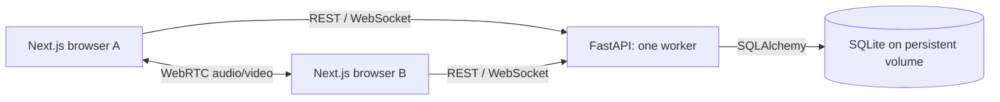
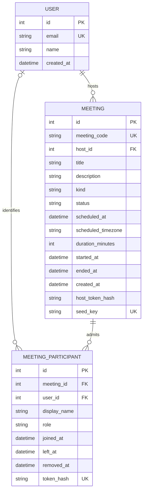

# Zoom Workplace — Scaler Fullstack Assignment

[](https://github.com/Vansh-7/zoom-clone/actions/workflows/ci.yml)

A Zoom-inspired meeting application with a real Next.js frontend, FastAPI backend, SQLite persistence, and peer-to-peer WebRTC audio/video. No login is required: Alex Morgan is the default organizer. All meeting lists and workflows use the API and database.

**Submission links:** [Live application](https://zoom-clone-vansh.vercel.app) · [Backend health](https://zoom-clone-api.up.railway.app/api/health) · [API documentation](https://zoom-clone-api.up.railway.app/docs) · [Public repository](https://github.com/Vansh-7/zoom-clone)

This is an original educational implementation, not an official Zoom product. Visual references: [Zoom home](https://assets.zoom.us/images/en-us/desktop/generic/home/home-screen.png) and [Zoom gallery view](https://developers.zoom.us/img/msdk-web-client-view-gallery.png).

## Features

- Responsive Home and Meetings views, upcoming/recent records, search, empty states, retry states, and a live clock.
- Instant meeting creation with a unique 11-digit ID and shareable invitation.
- Join by formatted ID or application invitation URL, including direct-link prejoin with a required display name.
- Scheduling with title, description, local date/time, timezone, duration, persisted records, and invitation copying.
- Real two-person camera/audio conferencing, media preview, microphone/camera toggles, roster, invitations, and leave/end actions.
- Server-authorized host mute-all, participant removal, and end-for-everyone.
- Clear media permission errors, joining without media, host-first scheduled admission, and explicit rejoining after disconnection.
- Three upcoming and three completed sample meetings, seeded once without duplication.

Profile, settings, and contacts are labeled placeholders. Login, chat, recording, and screen sharing are outside this assignment build.

## Stack and structure

Next.js App Router, React, strict TypeScript, Tailwind CSS 4, Lucide React; Python 3.11, FastAPI, SQLAlchemy, Pydantic, SQLite. REST handles workflows; WebSockets carry signaling and room events. Browser media travels through WebRTC, not through the API server.

```text
frontend/
  app/                 Routes, global styles, error pages
  components/          Dashboard, dialogs, meeting room, shared UI
  hooks/               Local media and WebRTC/signaling
  lib/                 Typed API client, invitations, date helpers
  types/               API contracts
  tests/               Playwright browser acceptance tests
backend/
  app/
    api/               HTTP and WebSocket endpoints
    services/          Meeting rules, ownership, admission, seeding
    websocket/         Isolated room registry and signaling
    config.py          Environment settings
    database.py        Engine, sessions, UTC timestamp type
    models.py          Relational database schema
    schemas.py         Pydantic input/output validation
    main.py            Startup, errors, CORS, cleanup
  tests/               API, database, and signaling tests
  Dockerfile           Single-worker production container
.github/workflows/    Automated API, frontend, and browser checks
```



## Local setup — Windows PowerShell

Requirements: Node.js 22+, Python 3.11+, and a modern browser. Run the following from the repository root in two terminals. Do not overwrite existing environment files when repeating setup.

Backend:

```powershell
cd backend
py -3.11 -m venv .venv
.\.venv\Scripts\python.exe -m pip install -r requirements-dev.txt
Copy-Item .env.example .env
.\.venv\Scripts\python.exe -m uvicorn app.main:app --host 127.0.0.1 --port 8000
```

Frontend:

```powershell
cd frontend
npm.cmd ci
Copy-Item .env.example .env.local
npm.cmd run dev
```

Open **http://localhost:3000**. API health: **http://127.0.0.1:8000/api/health**. Swagger: **http://127.0.0.1:8000/docs**.

For a local production build, use `npm.cmd run build` followed by `npm.cmd run start` instead of `npm.cmd run dev`. The npm scripts bind to `127.0.0.1`; this also avoids Windows IPv6 localhost conflicts. Set `FRONTEND_URL=http://127.0.0.1:3000` if that is the origin you share locally. Remote participants need a deployed HTTPS URL; another computer cannot use your localhost invitation.

On macOS/Linux, use `python3 -m venv .venv`, `.venv/bin/python`, `cp`, and `npm` in place of the Windows commands. Startup creates the schema and seeds the database automatically. The default database is `backend/data/zoom.db` and is excluded from Git. For a completely fresh demo, stop the backend and move this file and its SQLite sidecar files to a backup directory before restarting. Do not reset a deployed database.

## Environment

| Variable                   | Location             | Purpose/default                                                                            |
| -------------------------- | -------------------- | ------------------------------------------------------------------------------------------ |
| `NEXT_PUBLIC_API_BASE_URL` | Frontend, build time | API origin; local example `http://127.0.0.1:8000`. Required in production.                 |
| `DATABASE_URL`             | Backend              | `sqlite:///./data/zoom.db`; production `sqlite:////data/zoom.db`                           |
| `FRONTEND_URL`             | Backend              | Canonical invitation origin, local `http://localhost:3000`                                 |
| `CORS_ORIGINS`             | Backend              | Comma-separated exact frontend origins; also checked for WebSockets                        |
| `SEED_DATA`                | Backend              | `true`; creates six sample meetings only if their stable seed keys are absent              |
| `MAX_PARTICIPANTS`         | Backend              | `2` verified; validation permits up to 6, but larger rooms have not been acceptance-tested |
| `DISCONNECT_GRACE_SECONDS` | Backend              | `30`; grace before ending a call after host socket loss                                    |
| `ICE_SERVERS_JSON`         | Backend              | JSON array of WebRTC ICE servers; default public Google STUN                               |
| `PORT`                     | Container            | Platform HTTP port, default 8000                                                           |
| `RAILWAY_RUN_UID`          | Railway only         | `0` so the process can write Railway's root-owned volume                                   |

Example optional relay configuration:

```dotenv
ICE_SERVERS_JSON=[{"urls":"stun:stun.l.google.com:19302"},{"urls":"turn:your-relay.example:3478","username":"your-username","credential":"your-credential"}]
```

ICE configuration must be available to browsers. Use short-lived TURN credentials in a real production system; never commit live relay credentials. STUN alone cannot connect every network combination. [WebRTC explains when TURN is required](https://webrtc.org/getting-started/turn-server).

## Database design



Foreign keys are enforced on every SQLite connection. WAL mode and a busy timeout allow short concurrent read/write operations. Codes, seed keys, schedule/status queries, and membership queries are indexed. UTC timestamps are stored consistently and returned as timezone-aware ISO 8601 values. The original scheduling timezone is retained for explanation/display. Guest participants do not need User rows.

Seeding preserves original timestamps across restarts. Sample schedules eventually become missed rather than being silently moved into the future. Admission uses a short `BEGIN IMMEDIATE` transaction so simultaneous joins cannot bypass capacity or the single-host rule.

## API

All path identifiers below are 11-digit meeting codes, not internal row IDs. Swagger includes schemas and examples. Errors use `{ "error": { "code": "...", "message": "...", "fields": {} } }`; `fields` is included for input validation.

| Method | Path                                                              | Purpose                                                               |
| ------ | ----------------------------------------------------------------- | --------------------------------------------------------------------- |
| GET    | `/api/health`, `/api/user`                                        | Database readiness and default profile                                |
| GET    | `/api/meetings`, `/api/meetings/upcoming`, `/api/meetings/recent` | Stored meeting lists, capped at 100 per request                       |
| POST   | `/api/meetings/instant`                                           | Create; returns meeting + one-time host capability                    |
| POST   | `/api/meetings/schedule`                                          | Validate and persist schedule; same ownership response                |
| GET    | `/api/meetings/{code}`                                            | Public details, status, invitation                                    |
| POST   | `/api/meetings/{code}/claim`                                      | Atomically claim an unclaimed seeded demo                             |
| POST   | `/api/meetings/{code}/start`                                      | Host bearer capability required                                       |
| POST   | `/api/meetings/{code}/join`                                       | Required `display_name`; optional host bearer capability              |
| POST   | `/api/meetings/{code}/leave`                                      | Participant bearer capability required                                |
| POST   | `/api/meetings/{code}/end`                                        | Host bearer capability required                                       |
| GET    | `/api/rtc-config`                                                 | ICE servers and room capacity                                         |
| WS     | `/ws/meetings/{code}`                                             | First message `{ "type": "auth", "token": "participant-capability" }` |

WebSocket events include `welcome`, `participant-joined`, `participant-left`, `media-state`, targeted `offer`/`answer`/`candidate`, `mute-request`, `removed`, and `meeting-ended`. The server assigns sender identity and rejects cross-room targeting and guest host commands. Raw capabilities are excluded from URLs and public meeting responses.

## Meeting behavior and decisions

1. **Create:** cryptographic randomness generates an 11-digit code; a database unique constraint and bounded retries prevent collisions. The API persists before redirecting.
2. **Host ownership:** creation returns a random capability once. Its SHA-256 hash is stored in SQLite; the creating browser retains the raw value in localStorage. Clearing browser storage loses host access. This intentionally replaces login for the assignment, not for a commercial product.
3. **Join:** the public page retrieves real meeting details, requires a name, then requests admission. The server checks status, capacity, and ownership and returns a separate participant capability. Opening an invitation never grants host privileges.
4. **Schedule:** the browser validates local date/time, converts to UTC, and sends an aware timestamp plus IANA timezone. Invalid/past dates and durations are rejected server-side. Nonexistent daylight-saving local times are rejected; ambiguous fall-back times follow the browser's first occurrence.
5. **Lifecycle:** scheduled guests wait until the host starts. Ended/missed meetings reject admission. Planned duration does not terminate active calls. Host socket loss has a 30-second grace; reconnecting is an explicit rejoin. A backend restart ends active sessions while preserving all meeting records.
6. **WebRTC:** the lower participant ID makes the offer. The answerer uses offered transceivers; ICE candidates are queued until the remote description exists. Track replacement lets a participant enable devices after joining without renegotiating the whole call.
7. **Host actions:** authorization is checked on the server. Mute-all asks compliant browsers to disable microphones; guests can unmute themselves. Removal revokes that participant session, but a person can join again as a new guest because there is no account identity.

An instant meeting abandoned before its host joins can remain active until the host returns and ends it or the backend restarts. No complex recovery or lifecycle scheduler was added ahead of mandatory features.

## Verification

The following checks were executed locally on 8–9 October 2026:

| Check                                                    | Result                                                                                                           |
| -------------------------------------------------------- | ---------------------------------------------------------------------------------------------------------------- |
| Backend API, database, and signaling tests               | 25 passed on Windows; backend CI also passed on Linux                                                           |
| Browser acceptance tests against the production build    | 6 passed, including bidirectional synthetic audio/video, scheduling, host controls, and mobile permission denial |
| TypeScript, ESLint, Prettier, Ruff, and production build | Passed                                                                                                           |
| SQLite persistence                                       | Scheduled records survived backend and container restarts; six seed identities and timestamps remained unchanged |
| Production dependency audit                              | 0 vulnerabilities reported                                                                                       |

Cloud verification completed on **9 October 2026 (India time)** against the linked Vercel frontend and Railway backend:

| Deployed check                                                  | Result                                                                                                                                       |
| --------------------------------------------------------------- | -------------------------------------------------------------------------------------------------------------------------------------------- |
| Public production frontend                                      | Opens without Vercel login; production build Ready                                                                                           |
| HTTPS API health and Swagger                                    | Both return 200; health confirms SQLite                                                                                                      |
| CORS                                                            | Exact frontend origin accepted; unrelated origin rejected                                                                                    |
| Dashboard, instant creation, ID/direct-link joining, scheduling | Passed against the real deployed API and database                                                                                            |
| Full browser acceptance suite                                   | **6 passed** on the renamed production domains, including timezone hydration and participant departure checks                               |
| Two-person WebRTC over production WSS signaling                 | Both contexts received nonzero real audio/video RTP packets and decoded remote video frames using synthetic devices                         |
| Host controls and meeting cleanup                               | Mute-all, unmute, remove, leave/rejoin, and end-for-all passed                                                                               |
| Persistent Railway SQLite volume                                | Saved schedule `20264058542` retained its title, UTC time, duration, and other fields after restart; all six seed records remained identical |
| Desktop/tablet/mobile                                           | 1440, 768, and 390 px layouts and dialogs passed overflow/interaction checks and were visually reviewed                                      |
| CI with hydration, notification, and departure regression coverage | [Passed](https://github.com/Vansh-7/zoom-clone/actions/runs/37828438158)                                                                     |

Application code at `5260023` was verified on both deployed services. Frontend API configuration, backend invitation URLs, and CORS use the new production domains linked above. The previous frontend address redirects to the new address while preserving invitation paths. Railway uses one replica/worker and a 500 MB volume mounted at `/data`; the saved schedule remained present after the latest redeploy. Container restart logs confirm graceful shutdown followed by a fresh application startup. Evidence is kept in local ignored browser reports and `artifacts/`.

**Not verified:** physical camera/microphone quality, participants on different networks, TURN relay behavior, Safari/Firefox, or rooms larger than two. Synthetic media proves actual WebRTC transport/decoding between two browser contexts; it does not establish these separate outcomes.

Backend tests use temporary SQLite files. Browser tests create real records in the development database and inspect nonzero inbound audio/video RTP packets in both browser contexts. [GitHub Actions](https://github.com/Vansh-7/zoom-clone/actions/workflows/ci.yml) runs backend, frontend, and browser checks on pushes and pull requests. The backend test adapter emits a Starlette deprecation warning; all tests pass.

Run backend checks from `backend`:

```powershell
.\.venv\Scripts\python.exe -m pytest -q
.\.venv\Scripts\ruff.exe check app tests
.\.venv\Scripts\ruff.exe format --check app tests
```

Run frontend checks from `frontend`:

```powershell
npm.cmd run lint
npm.cmd run typecheck
npm.cmd run build
npm.cmd run format:check
```

With both servers running against a development database, run Chrome browser tests:

```powershell
$env:E2E_BROWSER_CHANNEL='chrome'
npm.cmd run test:e2e
```

If Chrome is not installed, run `npx.cmd playwright install chromium` and omit the channel variable. The suite uses synthetic camera/audio, creates real meeting records, checks inbound RTP packets on both participants, verifies host controls, and captures desktop/tablet/mobile layouts under ignored `artifacts/`. Physical devices, Safari/Firefox, and cross-network media must be verified separately.

## Deployment and submission

Use **Vercel frontend + Railway backend with a persistent volume**. The Docker image runs one Uvicorn worker; the signaling registry is process-local. Multiple workers/replicas need a shared signaling design.

The following steps also describe how to reproduce the deployment in your own account. Account login, GitHub installation access, billing eligibility, and any paid upgrade must be handled by the account owner. No paid upgrade is required by the application itself.

### 1. Create the Railway backend

1. Open Railway, select your workspace, and create an **Empty Project** named `zoom-clone`.
2. Add an **Empty Service** named `zoom-api`. Configure it before connecting GitHub so the first application startup uses persistent storage.
3. In service **Settings**, set the following values. Leave custom build/start/pre-deploy commands empty: the Dockerfile supplies the startup command. Initialization runs at startup because Railway does not mount volumes during builds or pre-deploy commands.

| Setting                       | Value                                               |
| ----------------------------- | --------------------------------------------------- |
| Root directory                | `/backend`                                          |
| Dockerfile                    | `Dockerfile` within that root                       |
| Health check                  | `/api/health`, timeout 120 seconds                  |
| Replicas/workers              | 1 each                                              |
| Restart policy                | On failure, 3 retries                               |
| Deployment overlap / draining | 0 seconds / 10 seconds                              |
| App sleeping / serverless     | Off; an active signaling server must remain running |
| Watch paths                   | `/backend/**`                                       |
| Persistent volume             | Mount at `/data`                                    |
| Public networking             | Generate HTTPS domain, target port `8000`           |

4. Attach a volume to `zoom-api`, mounted at `/data`. The submission uses **500 MB**. Confirm your account permits the volume and has sufficient credits; do not accept a paid upgrade automatically. Keep one replica in the volume's region.
5. In **Variables**, add the values below. Use your eventual stable Vercel production origin for `FRONTEND_URL` and `CORS_ORIGINS`; a temporary value can be replaced in step 3. Origins include the scheme and hostname, with no path or trailing slash.

```dotenv
DATABASE_URL=sqlite:////data/zoom.db
FRONTEND_URL=https://YOUR-FRONTEND.vercel.app
CORS_ORIGINS=https://YOUR-FRONTEND.vercel.app
SEED_DATA=true
MAX_PARTICIPANTS=2
DISCONNECT_GRACE_SECONDS=30
PORT=8000
RAILWAY_RUN_UID=0
ICE_SERVERS_JSON=[{"urls":"stun:stun.l.google.com:19302"}]
```

Railway volumes are root-owned; its [documented `RAILWAY_RUN_UID=0` setting](https://docs.railway.com/volumes#permissions) lets this container write the mounted database. Other hosts can provision a volume writable by the image's application user. Initialize and seed at application startup, when the volume is mounted. Verify persistent-volume eligibility and available account credits before deployment.

6. Connect **Source → GitHub → `Vansh-7/zoom-clone` → `main`**. If Railway cannot see the repository, the account owner must grant its GitHub installation access to this repository. Apply the changes and wait for a successful deployment.
7. Under **Networking**, generate the public domain targeting port `8000`. Open `https://YOUR-BACKEND.up.railway.app/api/health` and confirm `{"status":"ok","database":"sqlite"}`. Open `/docs` and check that the API renders. Do not proceed with an unhealthy backend; inspect build/runtime logs for dependency, volume permission, or port errors.

### 2. Deploy the Vercel frontend

1. Open Vercel → **Add New → Project**, import `Vansh-7/zoom-clone`, and select the repository's `main` branch for production. The account owner must grant GitHub repository access if import is unavailable.
2. Set **Root Directory** to `frontend`, **Framework** to Next.js, and **Node.js Version** to 22.x. Keep the default output directory. `frontend/vercel.json` defines `npm ci` and `npm run build`.
3. Add the following environment variable for **Production** before building. Add it to Preview/Development only if those builds should use this same demo backend:

```dotenv
NEXT_PUBLIC_API_BASE_URL=https://YOUR-BACKEND.up.railway.app
```

4. Deploy and wait for **Ready**. Use the stable project domain, such as `https://YOUR-FRONTEND.vercel.app`, for submission and invitations.
5. In **Security → Deployment Protection**, use **Standard Protection** if you want protected previews and a public production domain. Confirm the production homepage opens in a private browser without Vercel login. Do not submit a protected generated deployment URL.

### 3. Connect the origins and verify

1. Update Railway `FRONTEND_URL` and `CORS_ORIGINS` to the exact stable frontend origin, then apply/redeploy. Both REST CORS and WebSocket Origin validation use this allowlist. Do not use `*` or authorize every Vercel preview domain.
2. Confirm Vercel `NEXT_PUBLIC_API_BASE_URL` is the HTTPS backend **origin**, without `/api` or another path. Changing it requires a fresh frontend build because Next.js embeds public variables [at build time](https://nextjs.org/docs/app/guides/environment-variables#bundling-environment-variables-for-the-browser).
3. Open the frontend and confirm seeded upcoming/recent meetings load. The browser derives WSS from the HTTPS API origin. An HTTPS frontend pointing at an HTTP API will fail browser mixed-content checks.
4. Run the browser acceptance suite against these actual production URLs:

```powershell
cd frontend
$env:E2E_FRONTEND_URL='https://YOUR-FRONTEND.vercel.app'
$env:E2E_API_URL='https://YOUR-BACKEND.up.railway.app'
$env:E2E_BROWSER_CHANNEL='chrome'
npm.cmd run test:e2e
```

The suite creates identifiable test meetings in the shared database. It verifies the homepage, invalid IDs, scheduling and refresh persistence, direct invitations, joining by ID, two-way synthetic audio/video, host controls, ending, and responsive/error states. Screenshots and RTP evidence are saved locally in ignored artifacts/reports. It does not establish physical-device or cross-network audio quality.

5. With no active call, save a new future meeting and note its ID, title, UTC time, and duration. In Railway, restart the backend deployment. Wait for `/api/health` to recover, refresh the frontend, and retrieve `/api/meetings/{code}`. Confirm the exact record remains and seed records have not duplicated. A successful build alone does not verify persistence.
6. For the final human check, use two physical devices on different networks. Open the stable invitation URL, allow camera/microphone, join under different names, verify both directions of video and audible speech, toggle each device, and leave/end. Use headphones to avoid echo. If signaling connects but media fails on a restrictive network, configure a TURN relay in `ICE_SERVERS_JSON` and retest. TURN service credentials and cost decisions remain manual.

### Submission checklist

- Public GitHub repository with readable README and passing CI.
- Stable public HTTPS frontend URL, accessible without Vercel login.
- Backend HTTPS health and Swagger URLs.
- New Meeting creates a persisted record and opens the room.
- Join accepts ID and canonical invitation, requires a display name, and rejects an invalid meeting.
- Schedule persists and remains visible after refresh and backend restart.
- Dashboard uses stored upcoming/recent records and accurate statuses.
- Two participants exchange real audio/video; distinguish synthetic, physical-device, and cross-network evidence.
- Keep the Railway volume/credits available through evaluation. Redeploying preserves the volume; deleting the volume removes the database.

Deployment verification results are recorded above under Verification. Do not infer an untested result from local or CI success.

For database backups, use SQLite's online backup API or stop the backend before copying the database and WAL sidecars. Copying only a live WAL-mode database file can omit recent transactions.

## Scope and known limits

- Verified room capacity is two. Six-person configuration is available but unverified.
- STUN is included; restrictive NAT/firewall combinations may require TURN.
- No automatic ICE restart, seamless session recovery, durable signaling, account authentication, chat, recording, or screen sharing.
- The default organizer and dashboard data are shared across visitors, as allowed by the assignment. Meeting IDs are invitations, not secrets. The public demo is unsuitable for confidential meetings.
- SQLite and an in-process registry are appropriate for this single-instance assignment. Production scale needs identity, abuse controls, migrations/backups, shared state, and an SFU.
- Browser storage is required to retain host rights; no account recovery flow is provided.
- Production npm dependencies audit clean. The full audit reported five high findings in the development ESLint → fast-glob/micromatch/braces chain; no compatible automatic fix was available.
