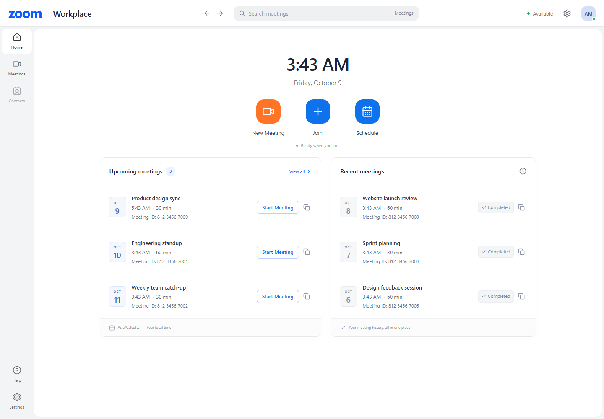
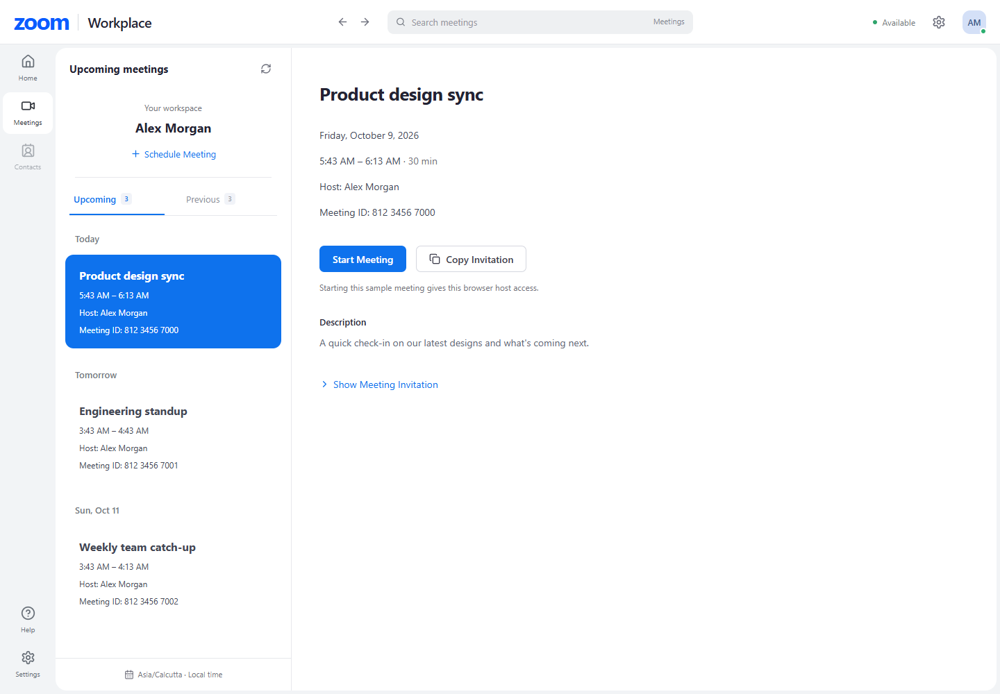
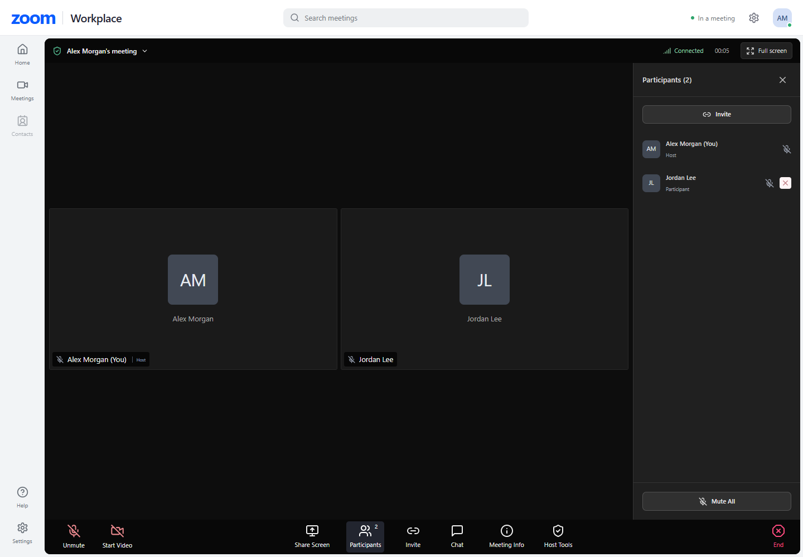
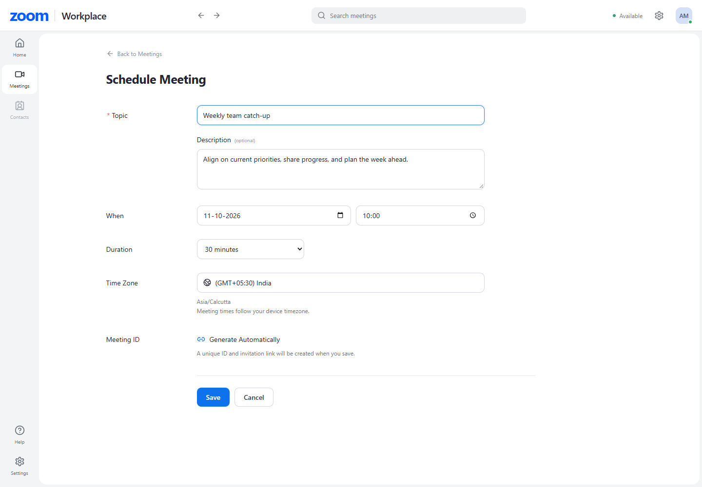
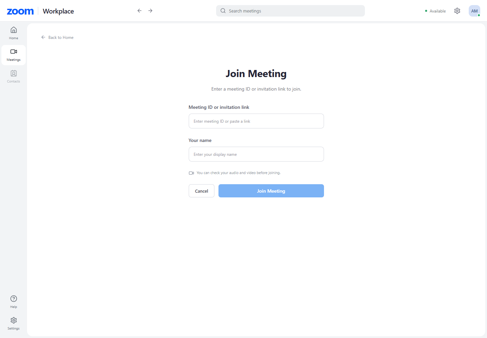
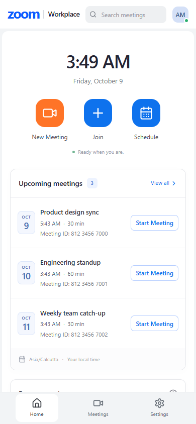
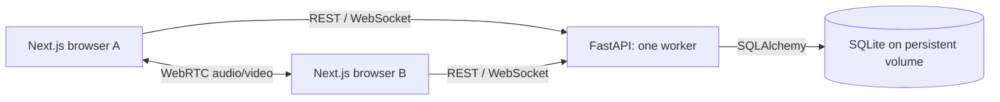
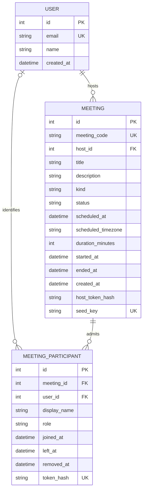

# Zoom Workplace — Scaler Fullstack Assignment

[](https://github.com/Vansh-7/zoom-clone/actions/workflows/ci.yml)

A Zoom-inspired meeting application with a real Next.js frontend, FastAPI backend, SQLite persistence, and peer-to-peer WebRTC audio/video. No login is required: Alex Morgan is the default organizer. All meeting lists and workflows use the API and database.

**Submission links:** [Live application](https://zoom-clone-vansh.vercel.app) · [Backend health](https://zoom-clone-api.up.railway.app/api/health) · [API documentation](https://zoom-clone-api.up.railway.app/docs) · [Public repository](https://github.com/Vansh-7/zoom-clone)

This is an original educational implementation, not an official Zoom product. Visual references: [Zoom home](https://assets.zoom.us/images/en-us/desktop/generic/home/home-screen.png) and [Zoom gallery view](https://developers.zoom.us/img/msdk-web-client-view-gallery.png).

## Features

- Zoom Workplace-inspired shared navigation, a compact Home clock/actions area, and SQLite-backed upcoming/recent cards.
- Split-view Meetings manager with date grouping, selection, Upcoming/Previous tabs, invitation details, and mobile list-to-detail navigation.
- Instant meeting creation with a unique 11-digit ID and shareable invitation.
- Dedicated `/join` page accepting formatted IDs or application invitation URLs, including direct-link prejoin with a required display name.
- Dedicated `/schedule` form with title, description, local date/time, friendly GMT offset plus IANA timezone, duration, persisted records, and invitation copying.
- Real two-person camera/audio conferencing, media preview, microphone/camera toggles, roster, invitations, and leave/end actions.
- Server-authorized host mute-all, participant removal, and end-for-everyone.
- Clear media permission errors, joining without media, host-first scheduled admission, and explicit rejoining after disconnection.
- Three initial upcoming and three completed sample meetings, with safe replenishment of future demos when older samples expire.
- Browser tab/window/screen sharing, remote presentation view, and camera restoration when sharing stops. Microphone audio remains unchanged.
- Meeting-isolated text chat with server-assigned names/timestamps, validation, and rate limiting.

Profile, settings, and contacts are labeled placeholders. Login, recording, and virtual backgrounds are outside this assignment build.

## Application screenshots

Captured from the actual local production build with SQLite-backed sample records. The room screenshot shows two admitted participants with cameras off; separate media tests verify real RTP and decoded frames.

These screenshots show the locally verified frontend refinement. The public deployment links above may still show the preceding release until these changes are published and deployed.













## Stack and structure

Next.js App Router, React, strict TypeScript, Tailwind CSS 4, Lucide React; Python 3.11, FastAPI, SQLAlchemy, Pydantic, SQLite. REST handles workflows; WebSockets carry signaling and room events. Browser media travels through WebRTC, not through the API server.

```text
frontend/
  app/                 Routes, global styles, error pages
  components/          Workspace shell, meeting manager/forms, room, shared UI
  hooks/               Local media and WebRTC/signaling
  lib/                 Typed API client, invitations, date helpers
  types/               API contracts
  tests/               Playwright browser acceptance tests
backend/
  app/
    api/               HTTP and WebSocket endpoints
    services/          Meeting rules, ownership, admission, seeding
    websocket/         Isolated room registry and signaling
    config.py          Environment settings
    database.py        Engine, sessions, UTC timestamp type
    models.py          Relational database schema
    schemas.py         Pydantic input/output validation
    main.py            Startup, errors, CORS, cleanup
  tests/               API, database, and signaling tests
  Dockerfile           Single-worker production container
.github/workflows/    Automated API, frontend, and browser checks
```



## Local setup — Windows PowerShell

Requirements: Node.js 22+, Python 3.11+, and a modern browser. Run the following from the repository root in two terminals. Do not overwrite existing environment files when repeating setup.

Backend:

```powershell
cd backend
py -3.11 -m venv .venv
.\.venv\Scripts\python.exe -m pip install -r requirements-dev.txt
Copy-Item .env.example .env
.\.venv\Scripts\python.exe -m app.server --host 127.0.0.1 --port 8000
```

Frontend:

```powershell
cd frontend
npm.cmd ci
Copy-Item .env.example .env.local
npm.cmd run dev
```

Open **http://localhost:3000**. API health: **http://127.0.0.1:8000/api/health**. Swagger: **http://127.0.0.1:8000/docs**.

For a local production build, use `npm.cmd run build` followed by `npm.cmd run start` instead of `npm.cmd run dev`. The npm scripts bind to `127.0.0.1`; this also avoids Windows IPv6 localhost conflicts. Set `FRONTEND_URL=http://127.0.0.1:3000` if that is the origin you share locally. Remote participants need a deployed HTTPS URL; another computer cannot use your localhost invitation.

On macOS/Linux, use `python3 -m venv .venv`, `.venv/bin/python`, `cp`, and `npm` in place of the Windows commands. Startup creates the schema and seeds the database automatically. The default database is `backend/data/zoom.db` and is excluded from Git. For a completely fresh demo, stop the backend and move this file and its SQLite sidecar files to a backup directory before restarting. Do not reset a deployed database.

## Environment

| Variable                   | Location             | Purpose/default                                                                            |
| -------------------------- | -------------------- | ------------------------------------------------------------------------------------------ |
| `NEXT_PUBLIC_API_BASE_URL` | Frontend, build time | API origin; local example `http://127.0.0.1:8000`. Required in production.                 |
| `DATABASE_URL`             | Backend              | `sqlite:///./data/zoom.db`; production `sqlite:////data/zoom.db`                           |
| `FRONTEND_URL`             | Backend              | Canonical invitation origin, local `http://localhost:3000`                                 |
| `CORS_ORIGINS`             | Backend              | Comma-separated exact frontend origins; also checked for WebSockets                        |
| `SEED_DATA`                | Backend              | `true`; initial samples plus bounded, idempotent future-demo replenishment                 |
| `MAX_PARTICIPANTS`         | Backend              | `2` verified; validation permits up to 6, but larger rooms have not been acceptance-tested |
| `DISCONNECT_GRACE_SECONDS` | Backend              | `30`; grace before ending a call after host socket loss                                    |
| `ICE_SERVERS_JSON`         | Backend              | JSON array of WebRTC ICE servers; default public Google STUN                               |
| `ICE_TRANSPORT_POLICY`     | Backend              | `all` for direct/relay candidates; `relay` forces TURN for diagnostics                     |
| `PORT`                     | Container            | Platform HTTP port, default 8000                                                           |
| `RAILWAY_RUN_UID`          | Railway only         | `0` so the process can write Railway's root-owned volume                                   |

Example optional relay configuration:

```dotenv
ICE_SERVERS_JSON=[{"urls":"stun:stun.l.google.com:19302"},{"urls":"turn:your-relay.example:3478","username":"your-username","credential":"your-credential"}]
```

ICE configuration must be available to browsers. Use short-lived TURN credentials in a real production system; never commit live relay credentials. STUN alone cannot connect every network combination. [WebRTC explains when TURN is required](https://webrtc.org/getting-started/turn-server).

## Database design



Foreign keys are enforced on every SQLite connection. WAL mode and a busy timeout allow short concurrent read/write operations. Codes, seed keys, schedule/status queries, and membership queries are indexed. UTC timestamps are stored consistently and returned as timezone-aware ISO 8601 values. The original scheduling timezone is retained for explanation/display. Guest participants do not need User rows.

Seeding preserves every original record and timestamp. At startup and on dashboard reads, each of three sample slots is checked for a future, unclaimed demo. If absent, a new record uses a stable key such as `sample-upcoming-0-2026-10-09`. A unique constraint and savepoint retries protect concurrent reads and code collisions. Each slot adds at most one replacement per UTC day, so repeatedly claiming demos cannot create unlimited records. Expired samples remain missed in recent history; claimed samples and real user-created meetings are never rewritten, rescheduled, or deleted. Set `SEED_DATA=false` to disable replenishment. Admission uses a short `BEGIN IMMEDIATE` transaction so simultaneous joins cannot bypass capacity or the single-host rule.

## API

All path identifiers below are 11-digit meeting codes, not internal row IDs. Swagger includes schemas and examples. Errors use `{ "error": { "code": "...", "message": "...", "fields": {} } }`; `fields` is included for input validation.

| Method | Path                                                              | Purpose                                                               |
| ------ | ----------------------------------------------------------------- | --------------------------------------------------------------------- |
| GET    | `/api/health`, `/api/user`                                        | Database readiness and default profile                                |
| GET    | `/api/meetings`, `/api/meetings/upcoming`, `/api/meetings/recent` | Stored meeting lists, capped at 100 per request                       |
| POST   | `/api/meetings/instant`                                           | Create; returns meeting + one-time host capability                    |
| POST   | `/api/meetings/schedule`                                          | Validate and persist schedule; same ownership response                |
| GET    | `/api/meetings/{code}`                                            | Public details, status, invitation                                    |
| POST   | `/api/meetings/{code}/claim`                                      | Atomically claim an unclaimed seeded demo                             |
| POST   | `/api/meetings/{code}/start`                                      | Host bearer capability required                                       |
| POST   | `/api/meetings/{code}/join`                                       | Required `display_name`; optional host bearer capability              |
| POST   | `/api/meetings/{code}/leave`                                      | Participant bearer capability required                                |
| POST   | `/api/meetings/{code}/end`                                        | Host bearer capability required                                       |
| GET    | `/api/rtc-config`                                                 | ICE servers and room capacity                                         |
| WS     | `/ws/meetings/{code}`                                             | First message `{ "type": "auth", "token": "participant-capability" }` |

WebSocket events include `welcome`, `participant-joined`, `participant-left`, `media-state` (including `screen_sharing`), targeted `offer`/`answer`/`candidate`/`restart-ice`, `chat`, `mute-request`, `removed`, and `meeting-ended`. The server assigns sender identity and rejects cross-room targeting and guest host commands. Chat text is trimmed, limited to 2000 characters and two messages per second per participant. Each browser retains only its latest 100 received messages; joining later or refreshing does not retrieve history. Raw capabilities are excluded from URLs and public meeting responses.

### WebSocket safeguards

Use `python -m app.server` for local and deployed startup. Docker and CI use this entry point: one Uvicorn worker, the explicitly selected `websockets` transport, a **65,536-byte** message limit, an incoming queue of **16 messages**, and compression disabled. Oversized text, binary, and fragmented messages are rejected by the protocol before ASGI delivery/JSON parsing. Bare `uvicorn app.main:app` does not inherit these settings. If overriding the command manually, supply `--workers 1 --ws websockets --ws-max-size 65536 --ws-max-queue 16 --ws-per-message-deflate false`. See [Uvicorn's transport settings](https://www.uvicorn.org/settings/).

Each authenticated command, including heartbeat, performs **one joined SELECT** checking the meeting, token hash, current role, and left/removed markers. Only the token digest is reused; positive authorization is never cached. REST leave/end and host removal close affected sockets immediately. Out-of-band database revocation is rejected on the next inbound command/heartbeat and closes the socket.

Limits are simple in-process token buckets in `backend/app/websocket/limits.py` and `manager.py`:

| Guard                                         | Default                                                                               |
| --------------------------------------------- | ------------------------------------------------------------------------------------- |
| All messages per connection                   | 160-message burst, replenished at 40/second; includes malformed input and ICE         |
| Non-candidate commands                        | 20-command burst, replenished at 5/second; includes ping, SDP, chat and host commands |
| Repeated malformed/unauthorized host commands | Close after 8 violations                                                              |
| Open WebSockets / pending authentication      | 128 total / 32 pending, at most 8 pending per network peer                            |
| Handshake attempts                            | Global burst 60, refill 10/second; per-peer burst 40, refill 2/second                 |
| Authentication                                | 5-second receive deadline, text-only frame at most 1024 bytes, bounded token input    |

Rate exhaustion sends `WS_RATE_LIMIT` and closes with 1008; transport oversize closes with 1009. A pre-upgrade rejection is an HTTP handshake rejection. Existing chat throttling remains two messages per second. Candidate logging uses debug level to avoid a log entry per candidate at production info level. A 120-candidate burst and normal ICE restart are regression-tested.

These bounds apply to this single process. Peer addresses come from the ASGI connection; arbitrary `X-Forwarded-For` headers are not parsed by the manager. Railway may expose shared proxy addresses, so per-peer limits can group visitors; global bounds remain effective. This is application protection rather than network-level DDoS mitigation. The pinned Uvicorn release supports the selected transport but emits deprecation warnings for its legacy adapter; transport behavior must be retested when upgrading dependencies.

## Meeting behavior and decisions

1. **Create:** cryptographic randomness generates an 11-digit code; a database unique constraint and bounded retries prevent collisions. The API persists before redirecting.
2. **Host ownership:** creation returns a random capability once. Its SHA-256 hash is stored in SQLite; the creating browser retains the raw value in localStorage. Clearing browser storage loses host access. This intentionally replaces login for the assignment, not for a commercial product.
3. **Join:** the public page retrieves real meeting details, requires a name, then requests admission. The server checks status, capacity, and ownership and returns a separate participant capability. Opening an invitation never grants host privileges.
4. **Schedule:** the browser validates local date/time, converts to UTC, and sends an aware timestamp plus IANA timezone. Invalid/past dates and durations are rejected server-side. Nonexistent daylight-saving local times are rejected; ambiguous fall-back times follow the browser's first occurrence.
5. **Lifecycle:** scheduled guests wait until the host starts. Ended/missed meetings reject admission. Planned duration does not terminate active calls. Host socket loss has a 30-second grace; reconnecting is an explicit rejoin. A backend restart ends active sessions while preserving all meeting records.
6. **WebRTC:** the lower participant ID makes the offer. The answerer uses offered transceivers; ICE candidates are queued until the remote description exists. Track replacement lets a participant enable devices after joining without renegotiating the whole call.
7. **Host actions:** authorization is checked on the server. Mute-all asks compliant browsers to disable microphones; guests can unmute themselves. Removal revokes that participant session, but a person can join again as a new guest because there is no account identity.
8. **Screen sharing:** `getDisplayMedia` runs directly from a button click. It replaces the existing video sender via `replaceTrack`, retaining the microphone track and the original camera stream. Stop Share, the browser's stop event, leaving, removal, and ending clean up capture. Camera on/off state is restored; shared content is displayed without mirroring or cropping. Shared system/tab audio is intentionally excluded.
9. **Chat:** authenticated WebSockets broadcast plain text only to the current room. The server supplies participant identity, message ID, and UTC timestamp. React renders the text without HTML interpretation. No chat tables or external messaging service are needed.

An instant meeting abandoned before its host joins can remain active until the host returns and ends it or the backend restarts. No complex recovery or lifecycle scheduler was added ahead of mandatory features.

## Media connectivity and TURN setup

A connected WebSocket and a visible participant roster confirm signaling, not a working media path. A delayed-negotiation regression reproduced two concurrent offers for one peer; signaling handlers now run in order, with an offer guard. ICE candidates wait for the matching remote description, including after an ICE restart. End-of-candidates messages are forwarded. This fixes a reproducible negotiation defect; it does not establish the cause of an earlier laptop-to-laptop failure without that session's ICE evidence.

If media fails, select **Copy connection diagnostics** in the meeting error message on **both laptops**. The report contains negotiation/ICE states, candidate-type counts, ICE server error codes, selected candidate types/protocol, and inbound RTP packet counts. It excludes candidate addresses, SDP, meeting capabilities, and TURN credentials. **Retry media connection** requests a new ICE generation without leaving the room. Browser console entries prefixed `[WebRTC]` and Railway `rtc_signal` logs distinguish negotiation failures from connectivity failures. A single ICE-server error can be nonfatal if another path succeeds; [error 701 indicates that a STUN/TURN server could not be reached](https://developer.mozilla.org/en-US/docs/Web/API/RTCPeerConnection/icecandidateerror_event).

Production currently has Google STUN only. Wi-Fi client isolation, firewall rules, blocked STUN, or incompatible NAT behavior can prevent direct media even when signaling works. A TURN relay is the fallback when direct paths cannot connect; Railway's HTTPS/WebSocket endpoint is not a TURN relay. The app supports provider-supplied authenticated TURN over UDP/TCP and TLS without changing frontend code.

To enable a hosted relay manually:

1. Obtain a TURN hostname, supported ports/transports, **username**, and **credential/password** from your TURN provider or your own coturn server. Use the provider's actual endpoints; the example below assumes UDP/TCP on 3478 and TLS on 443 are supported. Do not use a provider's administrative API key as the browser credential.
2. In Railway → `zoom-api` → Variables, replace **ICE_SERVERS_JSON** with a JSON array like this. Paste raw JSON without surrounding shell quotes, replacing every placeholder:

```json
[
  { "urls": "stun:stun.l.google.com:19302" },
  {
    "urls": [
      "turn:YOUR-TURN-HOST:3478?transport=udp",
      "turn:YOUR-TURN-HOST:3478?transport=tcp",
      "turns:YOUR-TURN-HOST:443?transport=tcp"
    ],
    "username": "YOUR-TURN-USERNAME",
    "credential": "YOUR-TURN-PASSWORD"
  }
]
```

3. Leave **ICE_TRANSPORT_POLICY=all** for normal use. This allows direct media and TURN fallback. For a temporary diagnostic, `relay` forces TURN and requires a configured TURN entry. Invalid JSON, URLs, or missing TURN credentials now fail configuration validation at startup instead of failing silently in browsers.
4. Apply the variables/redeploy, then rejoin with both laptops so new peer connections receive the configuration. The `/api/rtc-config` response must contain the intended endpoints and policy; inspect it privately because TURN credentials must be delivered to browsers. Responses are marked `no-store`. No Vercel rebuild is needed for ICE variable changes.
5. Run the relay-only test below. It forces relay policy in its browser contexts and requires a selected **relay** candidate plus real inbound audio/video in both directions. A gathered relay candidate alone is insufficient. Without configured TURN it explicitly **skips**, rather than passing.

```powershell
cd frontend
$env:E2E_FRONTEND_URL='https://zoom-clone-vansh.vercel.app'
$env:E2E_API_URL='https://zoom-clone-api.up.railway.app'
$env:E2E_BROWSER_CHANNEL='chrome'
npm.cmd run test:e2e -- tests/rtc.spec.ts --grep 'relay-only'
```

For testing a separate relay without modifying production, set `E2E_RTC_CONFIG_FILE` to an ignored JSON file under `artifacts/` containing `{ "ice_servers": [...] }`. Keep real credentials out of Git. Browser-visible static TURN credentials can be reused by visitors; use restricted/short-lived credentials, monitor relay quotas, and rotate them. A public production service should issue expiring TURN credentials to authorized participants.

The automated failure/retry test substitutes unreachable media candidates while keeping real signaling connected, then restores candidates and verifies RTP recovery. Separate UDP and TCP relay tests passed using a temporary authenticated local coturn fixture. Hosted TURN, TURN over TLS, and your physical laptops/networks remain unverified.

## Verification

The frontend refinement was verified locally on **9 October 2026 (India time)**:

| Check | Result |
| --- | --- |
| Backend pytest | **63 passed**; existing API, database, authorization, and signaling behavior preserved |
| Frontend lint, TypeScript, formatting, production build | Passed |
| Playwright against the local production build | **13 passed**, including mandatory workflows, host/sample claiming, keyboard navigation, two-way synthetic audio/video, ICE retry, UDP/TCP relay media, screen sharing, chat, and host controls |
| Scheduling timezone | Browser timezone and daylight-saving offset verified in a separate New York context; UTC persistence and host access checked |
| SQLite persistence | A scheduled record's ID, title, description, UTC timestamp, timezone, duration, and status survived an actual local backend restart |
| Visual comparison | Home, Meetings, Schedule, Join, and meeting room captured at **1440, 768, and 390 px** and compared with the supplied Zoom screenshots; mobile detail, chat, participants, and centered branding also inspected |
| Responsive interactions | No horizontal overflow; mobile list-to-detail/back navigation, tabs, form controls, and room toolbar bounds passed |

The backend and WebRTC hooks were not changed by this UI refinement. Temporary relay credentials and test services are local only. Physical camera/microphone quality, physical mobile keyboard behavior, cross-device/network conferencing, hosted TURN/TLS, and this refinement's production deployment have **not** been verified. Unsupported Zoom product/upgrade/calendar controls are intentionally omitted; branding and initials use original code rather than proprietary assets.

The targeted WebSocket reliability update was verified locally on **9 October 2026 (India time)**: **63 backend tests passed**, Ruff checks passed, frontend lint/typecheck/format/production build passed, and **all 11 browser tests passed**, including authenticated local UDP/TCP TURN transport, ICE restart, host controls, screen sharing, chat, and mandatory workflows. Real Uvicorn socket tests confirmed oversized text/binary/fragmented messages never reached ASGI, while a near-limit valid offer was forwarded. SQL instrumentation confirmed one joined SELECT per authentication/command and current-role host checks. The Docker image built successfully, returned healthy SQLite status, and rejected an oversized WebSocket message with code 1009. Temporary test servers, containers, and relay credentials were removed. These changes have not yet been deployed; the following cloud results describe the preceding application release.

The preceding application release was verified locally on **9 October 2026 (India time)**:

| Check                                              | Result                                                                                                                                                                                      |
| -------------------------------------------------- | ------------------------------------------------------------------------------------------------------------------------------------------------------------------------------------------- |
| Backend pytest                                     | **42 passed**, including expired/claimed samples, concurrency, collision retries, chat isolation/validation, and existing API/signaling checks                                              |
| Playwright against the local production build      | **11 passed**, including authenticated UDP/TCP relay transport, ICE failure/retry, screen-share cancellation/remote pixels/camera restoration, chat, mandatory workflows, and host controls |
| ESLint, TypeScript, Next.js production build, Ruff | Passed                                                                                                                                                                                      |
| Backend Docker image                               | Built successfully from the release source                                                                                                                                                  |
| SQLite persistence                                 | Real scheduled record retained its ID, title, description, UTC timestamp, timezone, duration, status, and creation time across an actual backend process restart                            |
| Visual review                                      | Official Zoom home/gallery references compared with actual 1440, 768, and 390 px screenshots; responsive interactions and overflow checks passed                                            |

The application release at `53a71a7` is deployed on both existing projects in Vansh's accounts: Railway's personal **Vansh Gupta's Projects** workspace and Vercel's **zoom-clone-vansh** project. Branch CI and [main CI](https://github.com/Vansh-7/zoom-clone/actions/runs/37845072352) passed before final production verification.

| Latest production check                   | Result                                                                                                                                                                             |
| ----------------------------------------- | ---------------------------------------------------------------------------------------------------------------------------------------------------------------------------------- |
| Railway / Vercel                          | Backend deployment `81b584bc-60ff-4d47-b08f-eed120a4e984` succeeded; frontend deployment `dpl_8z9dG9Bv94Abmaq4REAqe9Mf5Uxq` is Ready, both from `53a71a7`                          |
| Full Playwright suite against public URLs | **9 passed, 2 skipped**; relay tests correctly skipped without hosted TURN credentials                                                                                             |
| Mandatory workflows                       | Dashboard, instant creation, ID/direct-link join validation, scheduling, and refresh persistence passed                                                                            |
| Conferencing and host controls            | Bidirectional audio/video RTP and decoded frames, mute/unmute, leave/rejoin, removal, end-for-all, and failed-ICE retry passed                                                     |
| Screen sharing and chat                   | Remote presentation pixels, cancellation, browser-ended/camera-off restoration, continuing microphone audio, and bidirectional plain-text chat passed; capture input was synthetic |
| SQLite persistence                        | Schedule `57880163539` retained its ID, title, description, UTC timestamp, timezone, duration, status, and creation time across the actual backend deployment                      |
| Future samples                            | Three future unclaimed demos were returned; repeated dashboard reads retained identical sample IDs                                                                                 |
| Public access and origins                 | Public frontend returns 200 without login; HTTPS API healthy; exact CORS origin accepted and unrelated origin rejected; production WSS used by browser tests                       |
| Responsive/error states                   | Desktop/tablet/mobile overflow checks, backend unavailable/empty states, host-first waiting, and media permission denial passed                                                    |

Railway's source follows `main`, with the original `/data` volume and one replica preserved. Vercel follows the same repository's `main` branch. No additional required variables, schema migration, or dependencies were introduced. Hosted TURN/TLS, physical laptops/Wi-Fi, native screen-source selection, Safari/Firefox, and larger rooms remain untested.

Historical results for the earlier deployed release (8–9 October 2026):

| Check                                                    | Result                                                                                                           |
| -------------------------------------------------------- | ---------------------------------------------------------------------------------------------------------------- |
| Backend API, database, and signaling tests               | 37 passed on Windows; backend CI also passed on Linux                                                            |
| Browser acceptance tests against the production build    | 9 passed, including failed-ICE recovery, authenticated UDP/TCP relay RTP, and all existing meeting workflows     |
| TypeScript, ESLint, Prettier, Ruff, and production build | Passed                                                                                                           |
| SQLite persistence                                       | Scheduled records survived backend and container restarts; six seed identities and timestamps remained unchanged |
| Production dependency audit                              | 0 vulnerabilities reported                                                                                       |

Earlier cloud verification on **8–9 October 2026 (India time)**, before the release above:

| Deployed check                                                          | Result                                                                                                                                       |
| ----------------------------------------------------------------------- | -------------------------------------------------------------------------------------------------------------------------------------------- |
| Public production frontend                                              | Opens without Vercel login; production build Ready                                                                                           |
| HTTPS API health and Swagger                                            | Both return 200; health confirms SQLite                                                                                                      |
| CORS                                                                    | Exact frontend origin accepted; unrelated origin rejected                                                                                    |
| Dashboard, instant creation, ID/direct-link joining, scheduling         | Passed against the real deployed API and database                                                                                            |
| Full browser acceptance suite                                           | **7 passed, 2 skipped** on production; relay tests skip because hosted TURN credentials are not configured                                   |
| Two-person WebRTC over production WSS signaling                         | Both contexts received nonzero real audio/video RTP packets and decoded remote video frames using synthetic devices                          |
| Host controls, ICE recovery, and meeting cleanup                        | Mute-all, unmute, remove, leave/rejoin, end-for-all, duplicate joins, ICE-before-SDP ordering, and failed-ICE retry passed                   |
| Persistent Railway SQLite volume                                        | Saved schedule `20264058542` retained its title, UTC time, duration, and other fields after restart; all six seed records remained identical |
| Desktop/tablet/mobile                                                   | 1440, 768, and 390 px layouts and dialogs passed overflow/interaction checks and were visually reviewed                                      |
| CI with meeting, ICE failure/retry, and negotiation regression coverage | [Passed](https://github.com/Vansh-7/zoom-clone/actions/runs/37835540483)                                                                     |

Application code at `d54a6d1` was verified on both deployed services; `ec61145` only waits for asynchronous clipboard confirmation in the diagnostic test. Frontend API configuration, backend invitation URLs, and CORS use the production domains linked above. The previous frontend address redirects to the new address while preserving invitation paths. Railway uses one replica/worker and a 500 MB volume mounted at `/data`; the saved schedule remained present after the WebRTC redeploy. Container restart logs confirm graceful shutdown followed by a fresh application startup. Evidence is kept in local ignored browser reports and `artifacts/`.

**Not verified:** physical camera/microphone quality, your two laptops/networks, hosted TURN/TLS relay behavior, Safari/Firefox, or rooms larger than two. Local UDP/TCP relay and synthetic media tests prove actual transport/decoding between two browser contexts; they do not establish these separate outcomes.

Backend tests use temporary SQLite files. Browser tests create real records in the development database and inspect nonzero inbound audio/video RTP packets in both browser contexts. [GitHub Actions](https://github.com/Vansh-7/zoom-clone/actions/workflows/ci.yml) runs backend, frontend, and browser checks on pushes and pull requests. The backend test adapter emits a Starlette deprecation warning; all tests pass.

Run backend checks from `backend`:

```powershell
.\.venv\Scripts\python.exe -m pytest -q
.\.venv\Scripts\ruff.exe check app tests
.\.venv\Scripts\ruff.exe format --check app tests
```

Run frontend checks from `frontend`:

```powershell
npm.cmd run lint
npm.cmd run typecheck
npm.cmd run build
npm.cmd run format:check
```

With both servers running against a development database, run Chrome browser tests:

```powershell
$env:E2E_BROWSER_CHANNEL='chrome'
npm.cmd run test:e2e
```

If Chrome is not installed, run `npx.cmd playwright install chromium` and omit the channel variable. The suite uses synthetic camera/audio, creates real meeting records, checks inbound RTP packets on both participants, verifies host controls, and captures desktop/tablet/mobile layouts under ignored `artifacts/`. Physical devices, Safari/Firefox, and cross-network media must be verified separately.

## Deployment and submission

Use **Vercel frontend + Railway backend with a persistent volume**. The Docker image runs one Uvicorn worker; the signaling registry is process-local. Multiple workers/replicas need a shared signaling design.

The following steps also describe how to reproduce the deployment in your own account. Account login, GitHub installation access, billing eligibility, and any paid upgrade must be handled by the account owner. No paid upgrade is required by the application itself.

### Updating the existing deployment with this release

1. Push the reviewed focused commits to a review branch and let GitHub Actions pass before merging to `main`. The local release passed all checks; do not treat the older green CI run as validation of new commits.
2. With no active call, deploy the new `main` revision of Railway `zoom-api` (root `/backend`) while keeping the existing `/data` volume and variables. Restarting the signaling process ends active calls. If GitHub changes do not trigger Railway, use its Deploy Latest Commit action; restarting an old deployment does not update its source.
3. Deploy the same revision on Vercel (root `frontend`). Keep `NEXT_PUBLIC_API_BASE_URL=https://zoom-clone-api.up.railway.app`. Screen-sharing roster state and chat require the matching backend release; avoid verifying a mixed frontend/backend version.
4. Keep Railway `FRONTEND_URL` and `CORS_ORIGINS` at `https://zoom-clone-vansh.vercel.app`, `DATABASE_URL=sqlite:////data/zoom.db`, `SEED_DATA=true`, one worker/replica, and `ICE_TRANSPORT_POLICY=all`. No new required environment variable or schema migration is needed.
5. Verify `/api/health`, public frontend access, all four mandatory workflows, two-person audio/video, chat, and share/stop/camera restoration. Run the production browser command below, then perform the physical-device checklist. Confirm a saved schedule survives a Railway restart and samples remain idempotent.
6. Hosted TURN remains manual: provide your provider's relay URLs and username/credential in Railway `ICE_SERVERS_JSON`, apply/redeploy, and verify forced-relay tests. Never commit credentials. Public STUN alone does not guarantee every Wi-Fi/NAT combination.

For native screen-sharing verification: join with two desktop browsers, share a harmless tab/window, confirm the remote content and microphone speech, click Stop Share, repeat using the browser's own Stop Sharing control, cancel the picker, and repeat with the camera disabled. Confirm the camera's prior state returns each time. On unsupported mobile browsers, confirm the clear error and continued camera/audio operation.

### 1. Create the Railway backend

1. Open Railway, select your workspace, and create an **Empty Project** named `zoom-clone`.
2. Add an **Empty Service** named `zoom-api`. Configure it before connecting GitHub so the first application startup uses persistent storage.
3. In service **Settings**, set the following values. Leave custom build/start/pre-deploy commands empty: the Dockerfile supplies the startup command. Initialization runs at startup because Railway does not mount volumes during builds or pre-deploy commands.

| Setting                       | Value                                               |
| ----------------------------- | --------------------------------------------------- |
| Root directory                | `/backend`                                          |
| Dockerfile                    | `Dockerfile` within that root                       |
| Health check                  | `/api/health`, timeout 120 seconds                  |
| Replicas/workers              | 1 each                                              |
| Restart policy                | On failure, 3 retries                               |
| Deployment overlap / draining | 0 seconds / 10 seconds                              |
| App sleeping / serverless     | Off; an active signaling server must remain running |
| Watch paths                   | `/backend/**`                                       |
| Persistent volume             | Mount at `/data`                                    |
| Public networking             | Generate HTTPS domain, target port `8000`           |

4. Attach a volume to `zoom-api`, mounted at `/data`. The submission uses **500 MB**. Confirm your account permits the volume and has sufficient credits; do not accept a paid upgrade automatically. Keep one replica in the volume's region.
5. In **Variables**, add the values below. Use your eventual stable Vercel production origin for `FRONTEND_URL` and `CORS_ORIGINS`; a temporary value can be replaced in step 3. Origins include the scheme and hostname, with no path or trailing slash.

```dotenv
DATABASE_URL=sqlite:////data/zoom.db
FRONTEND_URL=https://YOUR-FRONTEND.vercel.app
CORS_ORIGINS=https://YOUR-FRONTEND.vercel.app
SEED_DATA=true
MAX_PARTICIPANTS=2
DISCONNECT_GRACE_SECONDS=30
PORT=8000
RAILWAY_RUN_UID=0
ICE_SERVERS_JSON=[{"urls":"stun:stun.l.google.com:19302"}]
ICE_TRANSPORT_POLICY=all
```

Railway volumes are root-owned; its [documented `RAILWAY_RUN_UID=0` setting](https://docs.railway.com/volumes#permissions) lets this container write the mounted database. Other hosts can provision a volume writable by the image's application user. Initialize and seed at application startup, when the volume is mounted. Verify persistent-volume eligibility and available account credits before deployment.

6. Connect **Source → GitHub → `Vansh-7/zoom-clone` → `main`**. If Railway cannot see the repository, the account owner must grant its GitHub installation access to this repository. Apply the changes and wait for a successful deployment.
7. Under **Networking**, generate the public domain targeting port `8000`. Open `https://YOUR-BACKEND.up.railway.app/api/health` and confirm `{"status":"ok","database":"sqlite"}`. Open `/docs` and check that the API renders. Do not proceed with an unhealthy backend; inspect build/runtime logs for dependency, volume permission, or port errors.

### 2. Deploy the Vercel frontend

1. Open Vercel → **Add New → Project**, import `Vansh-7/zoom-clone`, and select the repository's `main` branch for production. The account owner must grant GitHub repository access if import is unavailable.
2. Set **Root Directory** to `frontend`, **Framework** to Next.js, and **Node.js Version** to 22.x. Keep the default output directory. `frontend/vercel.json` defines `npm ci` and `npm run build`.
3. Add the following environment variable for **Production** before building. Add it to Preview/Development only if those builds should use this same demo backend:

```dotenv
NEXT_PUBLIC_API_BASE_URL=https://YOUR-BACKEND.up.railway.app
```

4. Deploy and wait for **Ready**. Use the stable project domain, such as `https://YOUR-FRONTEND.vercel.app`, for submission and invitations.
5. In **Security → Deployment Protection**, use **Standard Protection** if you want protected previews and a public production domain. Confirm the production homepage opens in a private browser without Vercel login. Do not submit a protected generated deployment URL.

### 3. Connect the origins and verify

1. Update Railway `FRONTEND_URL` and `CORS_ORIGINS` to the exact stable frontend origin, then apply/redeploy. Both REST CORS and WebSocket Origin validation use this allowlist. Do not use `*` or authorize every Vercel preview domain.
2. Confirm Vercel `NEXT_PUBLIC_API_BASE_URL` is the HTTPS backend **origin**, without `/api` or another path. Changing it requires a fresh frontend build because Next.js embeds public variables [at build time](https://nextjs.org/docs/app/guides/environment-variables#bundling-environment-variables-for-the-browser).
3. Open the frontend and confirm seeded upcoming/recent meetings load. The browser derives WSS from the HTTPS API origin. An HTTPS frontend pointing at an HTTP API will fail browser mixed-content checks.
4. Run the browser acceptance suite against these actual production URLs:

```powershell
cd frontend
$env:E2E_FRONTEND_URL='https://YOUR-FRONTEND.vercel.app'
$env:E2E_API_URL='https://YOUR-BACKEND.up.railway.app'
$env:E2E_BROWSER_CHANNEL='chrome'
npm.cmd run test:e2e
```

The suite creates identifiable test meetings in the shared database. It verifies the homepage, invalid IDs, scheduling and refresh persistence, direct invitations, joining by ID, two-way synthetic audio/video, host controls, ending, and responsive/error states. Screenshots and RTP evidence are saved locally in ignored artifacts/reports. It does not establish physical-device or cross-network audio quality.

5. With no active call, save a new future meeting and note its ID, title, UTC time, and duration. In Railway, restart the backend deployment. Wait for `/api/health` to recover, refresh the frontend, and retrieve `/api/meetings/{code}`. Confirm the exact record remains and seed records have not duplicated. A successful build alone does not verify persistence.
6. For the final human check, use two physical devices on different networks. Open the stable invitation URL, allow camera/microphone, join under different names, verify both directions of video and audible speech, toggle each device, and leave/end. Use headphones to avoid echo. If signaling connects but media fails on a restrictive network, configure a TURN relay in `ICE_SERVERS_JSON` and retest. TURN service credentials and cost decisions remain manual.

### Submission checklist

- Public GitHub repository with readable README and passing CI.
- Stable public HTTPS frontend URL, accessible without Vercel login.
- Backend HTTPS health and Swagger URLs.
- New Meeting creates a persisted record and opens the room.
- Join accepts ID and canonical invitation, requires a display name, and rejects an invalid meeting.
- Schedule persists and remains visible after refresh and backend restart.
- Dashboard uses stored upcoming/recent records and accurate statuses.
- Two participants exchange real audio/video; distinguish synthetic, physical-device, and cross-network evidence.
- Keep the Railway volume/credits available through evaluation. Redeploying preserves the volume; deleting the volume removes the database.

Deployment verification results are recorded above under Verification. Do not infer an untested result from local or CI success.

For database backups, use SQLite's online backup API or stop the backend before copying the database and WAL sidecars. Copying only a live WAL-mode database file can omit recent transactions.

## Scope and known limits

- Verified room capacity is two. Six-person configuration is available but unverified.
- STUN is included; restrictive NAT/firewall combinations may require TURN.
- Manual ICE restart and diagnostics are available. No automatic restart, seamless session recovery, durable signaling, account authentication, recording, or virtual backgrounds.
- Screen sharing replaces camera video while active; microphone speech continues, but shared tab/system audio is not included. Browser source selection and OS permissions need manual verification; mobile browser support varies.
- Chat is transient, retains the latest 100 messages per browser, and has no history for new arrivals or after refresh.
- The default organizer and dashboard data are shared across visitors, as allowed by the assignment. Meeting IDs are invitations, not secrets. The public demo is unsuitable for confidential meetings.
- SQLite and an in-process registry are appropriate for this single-instance assignment. Production scale needs identity, abuse controls, migrations/backups, shared state, and an SFU.
- Browser storage is required to retain host rights; no account recovery flow is provided.
- Production npm dependencies audit clean. The full audit reported five high findings in the development ESLint → fast-glob/micromatch/braces chain; no compatible automatic fix was available.
