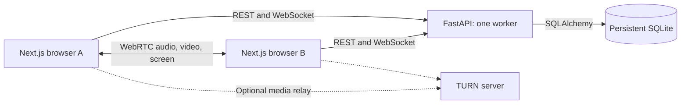

# Zoom Clone

A Zoom-inspired browser application for instant meetings, scheduling, and meeting history. Next.js and FastAPI manage the meeting workflows; WebRTC carries audio, video, and screen sharing between participants. No account is required.

[Live application](https://zoom-clone-vansh.vercel.app) · [Repository](https://github.com/Vansh-7/zoom-clone) · [API documentation](https://zoom-clone-api.up.railway.app/docs) · [Backend health](https://zoom-clone-api.up.railway.app/api/health)

## Features

- Home dashboard and split-view meeting manager with upcoming and previous meetings from SQLite.
- Instant meetings with unique 11-digit IDs, shareable invitations, and joining by ID or link.
- Scheduling with local date/time, timezone display, duration, and downloadable calendar invitations.
- Supports up to 4 participants per meeting using mesh-based WebRTC, with real-time audio/video, screen sharing, chat, and host controls.
- Prejoin camera/microphone selection and media preview; webcam video remains available during screen sharing.
- Server-authorized host start, mute-all, participant removal, and end-for-everyone controls.
- Room-scoped reactions and raised hands, gallery and manual speaker views, Hide Self View, and fullscreen.
- Responsive pages, keyboard navigation, permission messages, separate signaling/media status, diagnostics, and ICE retry.

## Stack and architecture

Next.js App Router, TypeScript, React, Tailwind CSS, and Lucide React on the frontend. FastAPI, Pydantic, SQLAlchemy, and SQLite on the backend. REST handles meeting records; WebSockets carry signaling, chat, and participant events.



A user owns meetings; each meeting has participant sessions. Foreign keys and unique meeting codes protect these relationships. Timestamps use UTC. Host and participant capabilities are hashed on the server; the creating browser retains host access.

## Screenshots

Captured from the local production build with SQLite-backed data. The meeting screenshot shows two participants with cameras off.

| Home                                               | Meetings                                                              |
| -------------------------------------------------- | --------------------------------------------------------------------- |
|             |                             |
| Schedule                                           | Join                                                                  |
|        |                                     |
| Meeting room                                       | Mobile                                                                |
|  |  |

## Run locally

Install Python 3.11 and Node.js 22. From PowerShell:

```powershell
git clone https://github.com/Vansh-7/zoom-clone.git
cd zoom-clone\backend
python -m venv .venv
.\.venv\Scripts\python.exe -m pip install -r requirements-dev.txt
Copy-Item .env.example .env
.\.venv\Scripts\python.exe -m app.server --host 127.0.0.1 --port 8000
```

In a second terminal, from the repository root:

```powershell
cd frontend
npm.cmd ci
Copy-Item .env.example .env.local
npm.cmd run dev
```

Open [localhost:3000](http://localhost:3000). Swagger is at [localhost:8000/docs](http://127.0.0.1:8000/docs). Startup initializes SQLite and idempotent sample data. Keep an existing `.env` or `.env.local` when it already contains your configuration.

For a local production build, replace `npm.cmd run dev` with `npm.cmd run build`, then `npm.cmd run start`. On macOS/Linux, use `.venv/bin/python`, `cp`, and `npm` in place of the Windows equivalents.

## Configuration and deployment

Use [backend/.env.example](backend/.env.example) and [frontend/.env.example](frontend/.env.example). Never commit actual environment files or TURN credentials.

| Variable                   | Purpose                                                                 |
| -------------------------- | ----------------------------------------------------------------------- |
| `NEXT_PUBLIC_API_BASE_URL` | Backend origin, set before the frontend build.                          |
| `DATABASE_URL`             | SQLite path; Railway uses `sqlite:////data/zoom.db`.                    |
| `FRONTEND_URL`             | Public frontend origin used in invitation links.                        |
| `CORS_ORIGINS`             | Comma-separated allowed browser origins, also checked for WebSockets.   |
| `SEED_DATA`                | Enable repeatable sample data and future sample replenishment.          |
| `MAX_PARTICIPANTS`         | Room capacity; default `4`.                                             |
| `DISCONNECT_GRACE_SECONDS` | Host disconnect grace period; default `30`.                             |
| `ICE_SERVERS_JSON`         | JSON array of STUN/TURN server definitions.                             |
| `ICE_TRANSPORT_POLICY`     | `all` normally; `relay` for relay-only verification.                    |
| `TRUSTED_PROXY_CIDRS`      | Confirmed proxy peers allowed to supply client identity; empty locally. |

1. **Railway:** use `backend` as the root directory and its Dockerfile. Mount a persistent volume at `/data`, set `DATABASE_URL=sqlite:////data/zoom.db` and `MAX_PARTICIPANTS=4`, and configure `/api/health` as the health check. Keep one worker and one replica. The startup script reads Railway's `PORT` and enforces WebSocket transport limits.
2. Set `FRONTEND_URL` and `CORS_ORIGINS` to the exact HTTPS frontend origin. Preserve the volume and existing variables when updating the service. Check volume permissions before changing the runtime user.
3. **Vercel:** use `frontend` as the root directory, the Next.js preset, Node.js 22, and `NEXT_PUBLIC_API_BASE_URL=https://zoom-clone-api.up.railway.app`. Keep the stable production domain public for evaluators.
4. Verify backend health, direct invitations, scheduling, four-person media, and fifth-participant rejection after deployment. HTTPS API configuration produces WSS signaling URLs. Coordinate backend restarts because active calls are interrupted; SQLite data remains on the volume.

Some networks require TURN. Configure provider-issued credentials in Railway's `ICE_SERVERS_JSON`, then redeploy the backend. This variable accepts a strict JSON array, not a JavaScript snippet or an `iceServers` wrapper. TURN entries require `urls`, `username`, and `credential`. Include the provider's UDP, TCP and TLS URLs, and keep `ICE_TRANSPORT_POLICY=all` for normal operation. Cross-network connectivity still requires testing on real devices.

## Tests

Backend, from `backend`:

```powershell
.\.venv\Scripts\python.exe -m pytest
.\.venv\Scripts\python.exe -m ruff check .
.\.venv\Scripts\python.exe -m ruff format --check .
```

Frontend, from `frontend`:

```powershell
npm.cmd run lint
npm.cmd run typecheck
npm.cmd run format:check
npm.cmd run build
npx.cmd playwright install chromium
npm.cmd run test:e2e
```

Start both servers before Playwright. Tests default to ports 3000 and 8000; `E2E_FRONTEND_URL` and `E2E_API_URL` override them. Use a separate SQLite database for browser tests because they create meeting records. Relay tests use configured TURN credentials or `E2E_RTC_CONFIG_FILE`; they skip when neither is available.

Local verification on October 9, 2026: 117 backend tests, 34 Chrome tests and 12 WebKit tests passed. Three optional performance cases and one WebKit media case were skipped. Ruff, frontend lint, type checking, formatting and production build passed. Chrome coverage includes four-person media at 360p/15 fps, separate webcam/screen tracks, reactions, host controls, ICE recovery, and relay-only UDP/TCP/TLS. Windows WebKit lacks WebRTC/MediaStream; Firefox could not launch because of a Windows runtime configuration error.

Manual verification: the maintainer reported a working four-participant call. Automated browser tests use synthetic media. Independent physical-device, sustained-call, and cross-network relay checks remain necessary.

## Limitations

- Signaling, chat history, and rate limits are process-local. Run one backend worker and replica with persistent SQLite storage.
- Each participant sends media to every other participant. Four-person calls require more upload bandwidth and device processing than two-person calls. Sustained quality and cross-network compatibility depend on devices, networks, and TURN availability.
- Host access is stored in the creating browser. Clearing its storage loses that access. A removed guest can return as a new session because account identity is not implemented.
- Screen sharing depends on browser support. Shared-system audio, recording, and account authentication are not implemented.
- Remote audio has an Enable Audio prompt when autoplay is blocked. Physical Safari playback still requires device verification.
- Profile, settings, and contacts are labeled placeholders. Camera/microphone access requires HTTPS or localhost.
